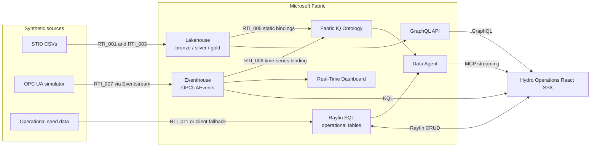
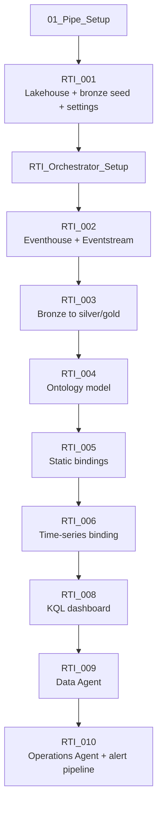
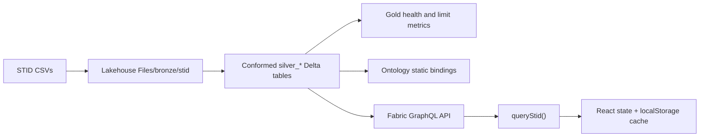
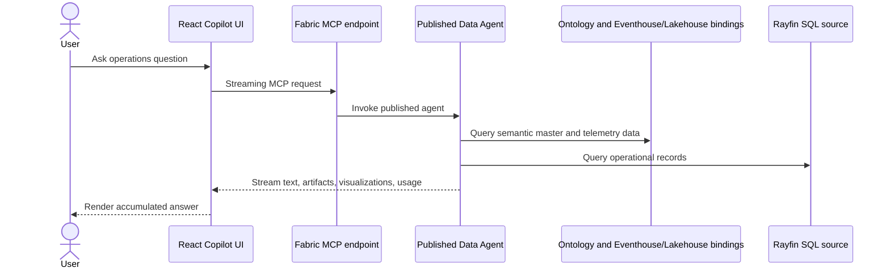

# Hydro Operations Demo Data Flow Analysis

## Scope

This document describes the implemented data flows in the Fabric IQ hydropower demo, from synthetic source data through Microsoft Fabric artifacts to the React application. It covers setup, runtime reads, user-triggered writes, agent interactions, identity boundaries, and failure behavior.

The central design choice is that the application composes three independent stores in the browser. Lakehouse master data, Eventhouse telemetry, and Rayfin SQL operational records are not merged into a single server-side model.

## Architecture Summary

| Layer | Artifact | Data owned | Primary access path |
|---|---|---|---|
| Source | STID CSV files | Facilities, systems, equipment, instruments | Setup notebooks |
| Analytical storage | Fabric Lakehouse | Bronze, silver, and gold engineering data | GraphQL API and ontology bindings |
| Real-time storage | Fabric Eventhouse / KQL database | OPC UA signal events | KQL queries and time-series ontology binding |
| Operational storage | Fabric SQL Database | Work orders, notifications, inspections, spare parts, 3D model metadata | Rayfin data client |
| Semantic layer | Fabric IQ Ontology | Entities, relationships, and static/time-series bindings | Fabric Data Agent |
| Presentation | React SPA hosted as a Fabric App | Browser-side joins, health state, charts, maintenance workflows | GraphQL, KQL, Rayfin, Fabric REST, and MCP |

## Source Data

### STID engineering master data

The setup starts with synthetic CSV files under [Raw/stid_rti_fixed_source_files](Raw/stid_rti_fixed_source_files). The principal files model:

| File | Role |
|---|---|
| `facilities_stid.csv` | Hydropower facilities and geographic attributes |
| `systems_stid.csv` | Plant systems associated with facilities |
| `equipment_stid.csv` | Turbine equipment associated with systems and facilities |
| `instruments_stid.csv` | Signals/instruments associated with equipment |

The current demo describes 3 facilities, 15 turbines, and 90 instruments. Stable identifiers are critical because they bridge otherwise independent stores:

- `facility_id` links systems, equipment, instruments, and UI filtering.
- `equipment_id` links STID assets to work orders, inspections, notifications, and 3D models.
- `opcua_node_id` links instruments, Eventhouse readings, work orders, and notifications.
- OPC UA node IDs encode the equipment tag, for example `ns=2;s=T001.inlet_pressure`.

### Operational seed data

Operational demo records are represented in three synchronized forms:

- [HydroOperationsApp/sql/seed-operational-data.sql](HydroOperationsApp/sql/seed-operational-data.sql) is the standalone idempotent SQL seed.
- `SEED_SQL` in [Notebooks/RTI_011_seed_sql_wire_graphql_agent.Notebook/notebook-content.py](Notebooks/RTI_011_seed_sql_wire_graphql_agent.Notebook/notebook-content.py) is the notebook-executed copy.
- [HydroOperationsApp/src/services/seedData.ts](HydroOperationsApp/src/services/seedData.ts) supports the authenticated client-side fallback.

The SQL schema is defined in [HydroOperationsApp/rayfin/data/schema.ts](HydroOperationsApp/rayfin/data/schema.ts). It contains work orders, maintenance notifications, inspections, spare parts, and asset 3D model metadata.

## Setup and Orchestration Flow

The setup DAG is owned by [Orchestrator_Pipelines/01_Pipe_Setup.DataPipeline/pipeline-content.json](Orchestrator_Pipelines/01_Pipe_Setup.DataPipeline/pipeline-content.json). It has two stages:

1. `RTI_001_create_lakehouse_SelfContained` creates or reuses the Lakehouse, uploads the STID files to the bronze area, derives versioned artifact names from `env_suffix`, and writes the shared `rti_demo_settings` Delta table.
2. `RTI_Orchestrator_Setup` attaches the Lakehouse and runs notebooks RTI_002 through RTI_006 and RTI_008 through RTI_010 in dependency order within one Spark session.

The pipeline passes workspace, Key Vault, environment suffix, Operations Agent destination, and timeout parameters into the notebooks. Pipeline defaults are examples from the source environment and must be overridden for another tenant or workspace.

### Notebook responsibilities

| Notebook | Input | Processing | Output |
|---|---|---|---|
| RTI_001 | STID CSVs, pipeline parameters, Key Vault coordinates | Creates Lakehouse, uploads bronze files, derives names | Bronze STID data and `rti_demo_settings` |
| RTI_002 | Shared settings | Creates Eventhouse, KQL database, `OPCUAEvents`, Eventstream | Real-time ingestion path |
| RTI_003 | Bronze STID files | Conforms data through bronze, silver, and gold layers | `silver_facilities`, `silver_systems`, `silver_equipment`, `silver_instruments`, `silver_signal_master`, gold metrics |
| RTI_004 | Silver model and shared settings | Defines five entities, four relationships, time-series properties | Versioned Fabric IQ Ontology |
| RTI_005 | Silver Delta tables and ontology | Creates static entity bindings and relationship contextualizations | Lakehouse-backed ontology entities |
| RTI_006 | `OPCUAEvents` and signal master | Maps node, timestamp, value, and quality columns | Eventhouse-backed ontology time series |
| RTI_008 | `OPCUAEvents` | Builds KQL visual queries and parses turbine tags from node IDs | Real-Time Dashboard |
| RTI_009 | Ontology | Creates and publishes an ontology-backed Data Agent | Natural-language analytical endpoint |
| RTI_010 | Ontology/agent settings and alert destination | Creates Operations Agent and alert pipeline | Teams/email operational action path |
| RTI_011 | Rayfin SQL item, Lakehouse, existing Data Agent | Seeds SQL, creates/binds GraphQL API, adds SQL as agent source, republishes | App-ready operational, GraphQL, and agent paths |

RTI_007 and RTI_011 are intentionally outside the setup DAG. They are run on demand by the application.

## Batch Master-Data Flow

[HydroOperationsApp/src/services/fabric.ts](HydroOperationsApp/src/services/fabric.ts) implements `queryStid()`. It sends one aliased GraphQL query for facilities, equipment, and instruments. The GraphQL API is discovered as a workspace item and called through the deterministic Fabric API path.

The app retries STID connection while RTI_011 publication settles. A previous successful response may be displayed from `localStorage`, but the application does not generate substitute master data when Fabric is unavailable.

## Real-Time Telemetry Flow

RTI_002 creates the target schema:

| `OPCUAEvents` column | Meaning |
|---|---|
| `event_time` | Source event timestamp |
| `opcua_node_id` | Stable signal key and encoded turbine/signal name |
| `value` | Numeric reading |
| `quality` | OPC UA quality: `GOOD`, `UNCERTAIN`, or `BAD` |

[Orchestrator_Pipelines/02_Pipe_Stream.DataPipeline/pipeline-content.json](Orchestrator_Pipelines/02_Pipe_Stream.DataPipeline/pipeline-content.json) invokes RTI_007. The notebook generates synthetic OPC UA events and sends them through the custom Eventstream endpoint into Eventhouse.

At runtime, `queryLatestTelemetry()` in [HydroOperationsApp/src/services/fabric.ts](HydroOperationsApp/src/services/fabric.ts) queries the last 24 hours and uses KQL `arg_max` to return the latest event for each node. `queryTelemetryHistory()` returns binned history for the selected node and time range.

The shared controller in [HydroOperationsApp/src/ui-shared/hooks/useHydroOperationsData.ts](HydroOperationsApp/src/ui-shared/hooks/useHydroOperationsData.ts):

- loads telemetry during initialization;
- polls every 30 seconds only after telemetry has been observed;
- pauses background polling while the document is hidden;
- retains the last successful readings if a poll fails;
- updates age labels every second without re-querying Fabric;
- classifies aggregate telemetry as live under 60 seconds, delayed under 5 minutes, and stale afterward;
- waits for a newly triggered stream to produce an event near the trigger time before reporting success.

Per-signal digital-twin freshness in [HydroOperationsApp/src/twin.ts](HydroOperationsApp/src/twin.ts) uses stricter thresholds: live under 30 seconds, recent under 2 minutes, stale under 15 minutes, and dead afterward.

## Operational SQL Flow

Rayfin provisions the Fabric SQL Database and exposes typed Data API Builder operations. The service in [HydroOperationsApp/src/services/rayfin.ts](HydroOperationsApp/src/services/rayfin.ts) owns application access.

| Entity | Read behavior | Write behavior | Cross-store key |
|---|---|---|---|
| Work order | Ordered newest first | Create, status update, delete | `equipmentId`, optional `instrumentId` and `opcuaNodeId` |
| Maintenance notification | Ordered newest first | Seeded; read-only in current app service | `equipmentId`, optional `opcuaNodeId` |
| Inspection | Ordered newest first | Seeded; read-only in current app service | `equipmentId`, optional `opcuaNodeId` |
| Spare part | Ordered by part number | Seeded; read-only in current app service | `equipmentType` |
| Asset 3D model | Ordered by update time | Seeded and refreshed when model URL changes | `equipmentId` |

The normal Seed & provision path triggers RTI_011 as a Fabric notebook job. Its SQL `MERGE` operations are idempotent, after which it publishes the GraphQL API and adds SQL as a Data Agent source. If the post-seed notebook is not configured, the browser falls back to `seedOperationalDataIfEmpty()` through the authenticated Rayfin client.

User work-order mutations are real SQL writes. The UI inserts newly created rows into local state and uses optimistic state updates for status changes and deletes, reverting state when the backend call fails.

## Browser-Side Composition

[HydroOperationsApp/src/main.tsx](HydroOperationsApp/src/main.tsx) selects UI v1 by default or UI v2 through `?ui=v2`. Both shells consume the same shared data controller, so their underlying flows are equivalent.

The browser joins records through maps and filters rather than a server-side federated query:

| UI composition | Join logic |
|---|---|
| Facility to assets/signals | STID `facility_id` |
| Latest reading to instrument | Eventhouse `opcua_node_id` = STID `opcua_node_id` |
| Work order to facility | SQL `equipmentId` -> STID equipment -> `facility_id` |
| Signal health to open work | SQL `opcuaNodeId` = STID/Eventhouse node ID |
| 3D model to selected asset | SQL `equipmentId` = STID `equipment_id` |
| Telemetry fallback mapping | Equipment tag parsed from `ns=2;s=<tag>.<signal>` |

This design keeps ownership clear and avoids duplicating master or telemetry records in SQL. Its tradeoff is that partial connectivity produces a partial UI: operational records may load without STID labels, or cached STID may remain visible while current telemetry is unavailable.

## Data Agent and Alert Flows

### Data Agent request flow

`askDataAgent()` discovers the newest suitable Data Agent and invokes its MCP endpoint. The service parses streamed assistant content, artifacts, visualizations, and token usage. Conversation state is held in the browser and can be reset by the user.

RTI_009 initially publishes the ontology source. RTI_011 later preserves that source, adds the app SQL database, and republishes the agent. Consequently, the Data Agent can answer across semantic telemetry/master data and operational work records without the React app constructing that cross-source query itself.

### Operations Agent alert flow

RTI_010 creates the Operations Agent and `Pipe_SendEmailAlert`. Alert delivery depends on a manually created Office 365 Outlook OAuth2 connection. This is separate from both the notebook service principal and browser SPA identity. Missing or expired mailbox consent breaks delivery even when the ontology and agent are healthy.

## Identity and Authorization Boundaries

| Identity | Credential model | Used by | Data/actions |
|---|---|---|---|
| Setup service principal | Client credentials, secret names resolved from Azure Key Vault | Pipelines and notebooks | Create/configure Fabric artifacts, seed SQL, publish agents |
| Signed-in SPA user | MSAL delegated tokens, browser `localStorage` cache | GraphQL, Eventhouse, Fabric REST, Data Agent | Read STID/telemetry, discover items, execute notebook/pipeline jobs, ask agent |
| Rayfin embedded user session | Fabric embedded authentication | Rayfin data client | Read and mutate operational SQL records |
| Outlook connection user | Fabric-managed OAuth2 connection | Alert pipeline | Send email from a mailbox |

The SPA requests resource-specific delegated tokens:

- Fabric GraphQL: `GraphQLApi.Execute.All`.
- Fabric item discovery and execution: `Workspace.Read.All`, `Item.Read.All`, and `Item.Execute.All`.
- Eventhouse: `<query-service-uri>/user_impersonation`.

Artifact IDs and service URIs are discovered at runtime by display name or item type and cached for the browser session. Build-time environment values are last-known-good fallbacks for pipeline IDs, notebook IDs, Eventhouse details, and an optional GraphQL URL. Discovery cache is cleared after RTI_011 so newly created artifacts can be found.

## Refresh, Caching, and Consistency

| Data | Refresh trigger | Cache/consistency behavior |
|---|---|---|
| STID | App initialization, explicit connect, post-RTI_011 readiness check | Successful payload cached in `localStorage`; publication retries use 5-second intervals |
| Latest telemetry | Initialization, explicit connect, stream startup wait, then 30-second polling | Last successful payload cached; freshness always uses source `event_time`, not fetch time |
| Telemetry history | Signal/range selection in telemetry page | Queried on demand from Eventhouse |
| Operational SQL | Initialization after Rayfin auth, explicit refresh, post-seed reload | Kept in React state; writes update state immediately |
| Workspace artifact configuration | First request and after provisioning | In-memory single-flight discovery cache |
| Running jobs | Every 4 seconds while active | Job metadata persisted locally for up to 30 minutes so reload can reattach |
| Agent conversation | On-demand streaming | Browser memory only; explicit reset starts a new conversation |

There is no distributed transaction across the three stores. A work order can reference a valid identifier while STID or telemetry is temporarily unavailable, and an RTI_011 run can seed SQL before GraphQL publication or agent republishing completes. The UI handles these as separate readiness states.

## Live, Synthetic, and Fallback Paths

| Flow | Nature | Fallback |
|---|---|---|
| STID master data | Synthetic seed persisted in Lakehouse | Last successful browser cache; otherwise disconnected state |
| OPC UA telemetry | Synthetic events persisted and queried live from Eventhouse | Last successful browser cache; no fabricated readings |
| Operational records | Synthetic initial seed followed by real SQL CRUD | Client-side idempotent seed if RTI_011 is unavailable |
| 3D assets | SQL metadata pointing to model URLs | UI thumbnail/model unavailable behavior |
| Data Agent answers | Live invocation over published Fabric sources | Error surfaced to chat; no locally generated answer |
| Alert delivery | Live Outlook pipeline action | No automatic alternate delivery channel |

## Risks and Operational Observations

1. **Cross-store referential integrity is conventional.** Fabric SQL does not enforce foreign keys to Lakehouse or Eventhouse. Seed scripts and stable IDs keep references aligned.
2. **Partial readiness is expected.** RTI_011 performs SQL seed, GraphQL publication, and agent republish sequentially. SQL may be ready before the other endpoints.
3. **Runtime discovery depends on permissions.** Missing `Item.Read.All` can allow workspace listing but prevent resolution of the Eventhouse query URI.
4. **Eventhouse access is resource-specific.** A user needs both an Eventhouse token and sufficient KQL database permissions; Fabric workspace access alone may not be enough.
5. **Cached data can outlive connectivity.** The UI preserves last-known STID and telemetry, but source timestamps drive freshness so dead streams become visibly stale.
6. **Operational seeding has multiple maintained copies.** The SQL script, RTI_011 embedded SQL, and TypeScript fallback must remain synchronized.
7. **Pipeline notebook references are GUID-based.** Moving pipelines between workspaces requires Git/Fabric synchronization to repoint item references correctly.
8. **GraphQL endpoint construction is an implementation dependency.** Discovery finds the GraphQL item, then the app constructs the deterministic Fabric API endpoint because item metadata does not expose it directly.
9. **Alerting has a manual identity dependency.** Outlook OAuth2 setup and token renewal cannot be completed by the notebook service principal.
10. **The browser is the operational integration layer.** This is appropriate for a demo, but production reporting or automation may need a governed server-side serving model, audit trail, and stronger consistency controls.

## Validation Checklist

Use these checks to validate each boundary independently:

1. Run `01_Pipe_Setup` and confirm all setup notebooks complete.
2. Query Lakehouse table counts for the expected silver tables and inspect `rti_demo_settings`.
3. Query `OPCUAEvents | summarize rows=count(), latest=max(event_time) by quality` in the KQL database.
4. Run `02_Pipe_Stream` and confirm `latest` advances rather than only the row count changing.
5. List workspace items and confirm the Lakehouse, Eventhouse, Ontology, GraphQL API, Data Agent, dashboard, and pipelines exist with the expected suffix.
6. Run RTI_011 from Seed & provision, then validate row counts with [HydroOperationsApp/sql/validate-seed.sql](HydroOperationsApp/sql/validate-seed.sql).
7. Query the GraphQL API for facilities, equipment, and instruments as the signed-in SPA user.
8. Verify one `opcua_node_id` resolves to the same instrument in Lakehouse and latest event in Eventhouse.
9. Create, change, and delete a work order in the app, then verify the corresponding SQL row.
10. Ask the Data Agent one ontology question and one work-order question to verify both sources survived republishing.
11. Trigger a test alert and verify the Outlook connection and destination independently of agent creation.
12. Build and statically validate the app from `HydroOperationsApp` with `npm run typecheck`, `npm run lint`, and `npm run build` using the repository's Node 24 wrapper guidance.

## Key Implementation Files

- [README.md](README.md): Fabric artifact naming, setup DAG, prerequisites, and notebook catalog.
- [HydroOperationsApp/README.md](HydroOperationsApp/README.md): application architecture and store ownership.
- [HydroOperationsApp/src/services/fabric.ts](HydroOperationsApp/src/services/fabric.ts): MSAL, artifact discovery, Fabric jobs, GraphQL, KQL, and Data Agent MCP.
- [HydroOperationsApp/src/services/rayfin.ts](HydroOperationsApp/src/services/rayfin.ts): operational SQL reads, writes, authentication, and fallback seed.
- [HydroOperationsApp/src/ui-shared/hooks/useHydroOperationsData.ts](HydroOperationsApp/src/ui-shared/hooks/useHydroOperationsData.ts): refresh policy, browser joins, readiness state, and UI mutations.
- [HydroOperationsApp/src/twin.ts](HydroOperationsApp/src/twin.ts): signal health and freshness classification.
- [Orchestrator_Pipelines/01_Pipe_Setup.DataPipeline/pipeline-content.json](Orchestrator_Pipelines/01_Pipe_Setup.DataPipeline/pipeline-content.json): setup pipeline dependencies and parameters.
- [Orchestrator_Pipelines/02_Pipe_Stream.DataPipeline/pipeline-content.json](Orchestrator_Pipelines/02_Pipe_Stream.DataPipeline/pipeline-content.json): on-demand telemetry generator.
- [Notebooks/RTI_Orchestrator_Setup.Notebook/notebook-content.py](Notebooks/RTI_Orchestrator_Setup.Notebook/notebook-content.py): stage-two notebook execution order.
- [Notebooks/RTI_011_seed_sql_wire_graphql_agent.Notebook/notebook-content.py](Notebooks/RTI_011_seed_sql_wire_graphql_agent.Notebook/notebook-content.py): post-seed SQL, GraphQL, and Data Agent wiring.