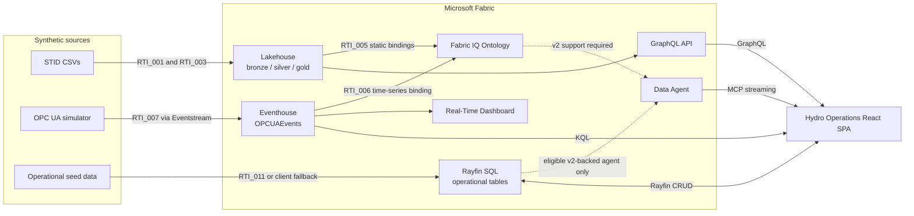
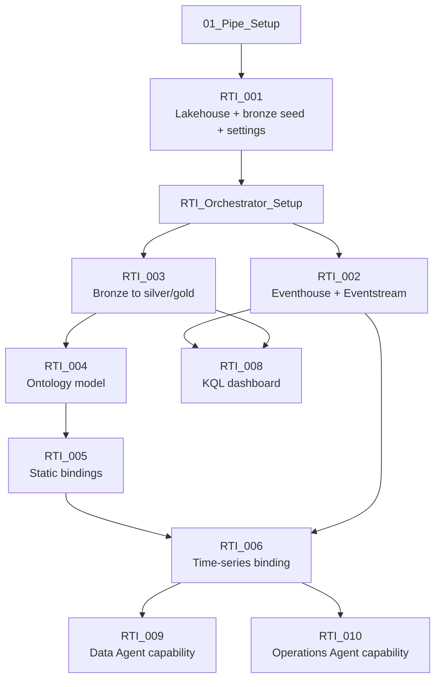
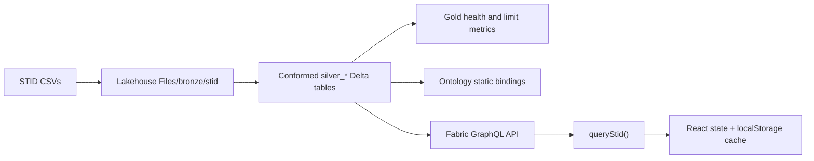
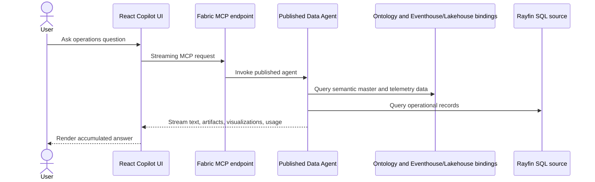

# Hydro Operations Demo Data Flow Analysis

## Scope

This document describes the implemented data flows in the Fabric IQ hydropower demo, from synthetic source data through Microsoft Fabric artifacts to the React application. It covers setup, runtime reads, user-triggered writes, agent interactions, identity boundaries, and failure behavior.

The central design choice is that the application composes the live Ontology v2 TMDL semantic contract with external operational context in the browser. Lakehouse GraphQL provides instance rows, Eventhouse KQL provides telemetry, and Rayfin SQL provides operational records. Generation-1 ontologies are rejected. Native v2 GraphModel association is not yet verified, so the app explicitly reports native graph unavailability rather than selecting an unrelated graph. The detailed contract is documented in [docs/knowledge-graph.md](docs/knowledge-graph.md).

## Architecture Summary

| Layer | Artifact | Data owned | Primary access path |
|---|---|---|---|
| Source | STID CSV files | Facilities, systems, equipment, instruments | Setup notebooks |
| Analytical storage | Fabric Lakehouse | Bronze, silver, and gold engineering data | GraphQL API and ontology bindings |
| Real-time storage | Fabric Eventhouse / KQL database | OPC UA signal events | KQL queries and time-series ontology binding |
| Operational storage | Fabric SQL Database | Work orders, notifications, inspections, spare parts, 3D model metadata | Rayfin data client |
| Semantic layer | Fabric IQ Ontology v2 | Entities, relationships, and static/time-series bindings | TMDL definition; Data Agent only when supported and enabled |
| Presentation | React SPA hosted as a Fabric App | Browser-side joins, health state, charts, maintenance workflows | GraphQL, KQL, Rayfin, Fabric REST, and MCP |

```mermaid
flowchart LR
    subgraph Sources["Synthetic sources"]
        STID["STID CSVs"]
        SIM["OPC UA simulator"]
        OPS["Operational seed data"]
    end

    subgraph Fabric["Microsoft Fabric"]
        LH["Lakehouse\nbronze / silver / gold"]
        EH["Eventhouse\nOPCUAEvents"]
        SQL["Rayfin SQL\noperational tables"]
        ONT["Fabric IQ Ontology"]
        GQL["GraphQL API"]
        AGENT["Data Agent"]
        DASH["Real-Time Dashboard"]
    end

    APP["Hydro Operations React SPA"]

    STID -->|RTI_001 and RTI_003| LH
    SIM -->|RTI_007 via Eventstream| EH
    OPS -->|RTI_011 or client fallback| SQL
    LH -->|RTI_005 static bindings| ONT
    EH -->|RTI_006 time-series binding| ONT
    LH --> GQL
    ONT -.->|v2 support required| AGENT
    SQL -.->|eligible v2-backed agent only| AGENT
    EH --> DASH
    GQL -->|GraphQL| APP
    EH -->|KQL| APP
    SQL <-->|Rayfin CRUD| APP
    AGENT -->|MCP streaming| APP
```

The Fabric IQ Ontology remains the governed semantic asset. The SPA currently reaches Lakehouse
instances through the RTI_011 GraphQL item and Eventhouse observations through KQL, then
`buildKnowledgeGraph()` materializes an application property graph from stable identifiers. Fabric
Ontology `getDefinition` is a definition and binding surface, not a bulk instance-graph response.

## Source Data

### STID engineering master data

The setup starts with synthetic CSV files under [Raw/stid_rti_fixed_source_files](Raw/stid_rti_fixed_source_files). The principal files model:

| File | Role |
|---|---|
| `facilities_stid.csv` | Hydropower facilities and geographic attributes |
| `systems_stid.csv` | Plant systems associated with facilities |
| `equipment_stid.csv` | Turbine equipment associated with systems and facilities |
| `instruments_stid.csv` | Signals/instruments associated with equipment |

The current demo describes 3 facilities, 15 turbines, and 90 instruments. Stable identifiers are critical because they bridge otherwise independent stores:

- `facility_id` links systems, equipment, instruments, and UI filtering.
- `equipment_id` links STID assets to work orders, inspections, notifications, and 3D models.
- `opcua_node_id` links instruments, Eventhouse readings, work orders, and notifications.
- OPC UA node IDs encode the equipment tag, for example `ns=2;s=T001.inlet_pressure`.

### Operational seed data

Operational demo records are represented in three synchronized forms:

- [HydroOperationsApp/sql/seed-operational-data.sql](HydroOperationsApp/sql/seed-operational-data.sql) is the standalone idempotent SQL seed.
- `SEED_SQL` in [Notebooks/RTI_011_seed_sql_wire_graphql_agent.Notebook/notebook-content.py](Notebooks/RTI_011_seed_sql_wire_graphql_agent.Notebook/notebook-content.py) is the notebook-executed copy.
- [HydroOperationsApp/src/services/seedData.ts](HydroOperationsApp/src/services/seedData.ts) supports the authenticated client-side fallback.

The SQL schema is defined in [HydroOperationsApp/rayfin/data/schema.ts](HydroOperationsApp/rayfin/data/schema.ts). It contains work orders, maintenance notifications, inspections, spare parts, and asset 3D model metadata.

## Setup and Orchestration Flow

The setup DAG is owned by [Orchestrator_Pipelines/01_Pipe_Setup.DataPipeline/pipeline-content.json](Orchestrator_Pipelines/01_Pipe_Setup.DataPipeline/pipeline-content.json). It has two stages:

1. `RTI_001_create_lakehouse_SelfContained` creates or reuses the Lakehouse, uploads the STID files to the bronze area, derives versioned artifact names from `env_suffix`, and writes the shared `rti_demo_settings` Delta table.
2. `RTI_Orchestrator_Setup` attaches the Lakehouse and runs notebooks RTI_002 through RTI_006 and RTI_008 through RTI_010 in dependency order within one Spark session.

The pipeline passes workspace, Key Vault, environment suffix, Operations Agent destination,
optional agent capability modes, and timeout parameters into the notebooks. Pipeline defaults
are examples from the source environment and must be overridden for another tenant or workspace.
Generation-2 agent limitations are explicit capability results, not a failure of core ontology
or weather provisioning. See [ontology generation policies](README.md#ontology-generations-and-optional-agents).

```mermaid
flowchart TD
    PIPE["01_Pipe_Setup"] --> N1["RTI_001\nLakehouse + bronze seed + settings"]
    N1 --> ORCH["RTI_Orchestrator_Setup"]
    ORCH --> N2["RTI_002\nEventhouse + Eventstream"]
    ORCH --> N3["RTI_003\nBronze to silver/gold"]
    N3 --> N4["RTI_004\nOntology model"]
    N4 --> N5["RTI_005\nStatic bindings"]
    N5 --> N6["RTI_006\nTime-series binding"]
    N2 --> N6
    N2 --> N8["RTI_008\nKQL dashboard"]
    N3 --> N8
    N6 --> N9["RTI_009\nData Agent capability"]
    N6 --> N10["RTI_010\nOperations Agent capability"]
```

### Notebook responsibilities

| Notebook | Input | Processing | Output |
|---|---|---|---|
| RTI_001 | STID CSVs, pipeline parameters, Key Vault coordinates | Creates Lakehouse, uploads bronze files, derives names | Bronze STID data and `rti_demo_settings` |
| RTI_002 | Shared settings | Creates Eventhouse, KQL database, `OPCUAEvents`, Eventstream | Real-time ingestion path |
| RTI_003 | Bronze STID files | Conforms data through bronze, silver, and gold layers | `silver_facilities`, `silver_systems`, `silver_equipment`, `silver_instruments`, `silver_signal_master`, gold metrics |
| RTI_004 | Silver model and shared settings | Creates explicit v2 TMDL roots; safely reconciles five entities, four semantic relationships, time-series properties; verifies readback | Generation-2 ontology plus verified TMDL/audit outputs |
| RTI_005 | Silver Delta tables and v2 ontology | Binds Direct Lake tables, scalar properties, and physical joins referenced by semantic relationships | Lakehouse-backed v2 entities |
| RTI_006 | `OPCUAEvents` and signal master | Maps node, timestamp, value, and quality columns | Eventhouse-backed ontology time series |
| RTI_008 | `OPCUAEvents` | Builds KQL visual queries and parses turbine tags from node IDs | Real-Time Dashboard |
| RTI_009 | Fully bound v2 ontology and capability policy | Explicit enablement attempts matching draft/published source configuration; otherwise reports blocked/skipped | Published-source evidence or explicit capability status, not runtime certification |
| RTI_010 | Fully bound v2 ontology, capability policy | Reports blocked/skipped; explicit enablement fails before writes until a verified v2 playbook contract exists | Explicit capability status, no legacy playbook |
| RTI_011 | Rayfin SQL item, Lakehouse, optional Data Agent | Seeds SQL, creates/binds GraphQL API; extends an eligible agent separately | Operational/GraphQL paths plus independent agent-source status |

RTI_007 and RTI_011 are intentionally outside the setup DAG. They are run on demand by the application.

## Batch Master-Data Flow

```mermaid
flowchart LR
    CSV["STID CSVs"] --> BRONZE["Lakehouse Files/bronze/stid"]
    BRONZE --> SILVER["Conformed silver_* Delta tables"]
    SILVER --> GOLD["Gold health and limit metrics"]
    SILVER --> BIND["Ontology static bindings"]
    SILVER --> API["Fabric GraphQL API"]
    API --> QUERY["queryStid()"]
    QUERY --> CACHE["React state + localStorage cache"]
```

[HydroOperationsApp/src/services/fabric.ts](HydroOperationsApp/src/services/fabric.ts) implements `queryStid()`. It sends one aliased GraphQL query for facilities, equipment, and instruments. The GraphQL API is discovered as a workspace item and called through the deterministic Fabric API path.

The app retries STID connection while RTI_011 publication settles. A previous successful response may be displayed from `localStorage`, but the application does not generate substitute master data when Fabric is unavailable.

## Real-Time Telemetry Flow

RTI_002 creates the target schema:

| `OPCUAEvents` column | Meaning |
|---|---|
| `event_time` | Source event timestamp |
| `opcua_node_id` | Stable signal key and encoded turbine/signal name |
| `value` | Numeric reading |
| `quality` | OPC UA quality: `GOOD`, `UNCERTAIN`, or `BAD` |

[Orchestrator_Pipelines/02_Pipe_Stream.DataPipeline/pipeline-content.json](Orchestrator_Pipelines/02_Pipe_Stream.DataPipeline/pipeline-content.json) invokes RTI_007. The notebook generates synthetic OPC UA events and sends them through the custom Eventstream endpoint into Eventhouse.

At runtime, `queryLatestTelemetry()` in [HydroOperationsApp/src/services/fabric.ts](HydroOperationsApp/src/services/fabric.ts) queries the last 24 hours and uses KQL `arg_max` to return the latest event for each node. `queryTelemetryHistory()` returns binned history for the selected node and time range.

The shared controller in [HydroOperationsApp/src/ui-shared/hooks/useHydroOperationsData.ts](HydroOperationsApp/src/ui-shared/hooks/useHydroOperationsData.ts):

- loads telemetry during initialization;
- polls every 30 seconds only after telemetry has been observed;
- pauses background polling while the document is hidden;
- retains the last successful readings if a poll fails;
- updates age labels every second without re-querying Fabric;
- classifies aggregate telemetry as live under 60 seconds, delayed under 5 minutes, and stale afterward;
- waits for a newly triggered stream to produce an event near the trigger time before reporting success.

Per-signal digital-twin freshness in [HydroOperationsApp/src/twin.ts](HydroOperationsApp/src/twin.ts) uses stricter thresholds: live under 30 seconds, recent under 2 minutes, stale under 15 minutes, and dead afterward.

## Operational SQL Flow

Rayfin provisions the Fabric SQL Database and exposes typed Data API Builder operations. The service in [HydroOperationsApp/src/services/rayfin.ts](HydroOperationsApp/src/services/rayfin.ts) owns application access.

| Entity | Read behavior | Write behavior | Cross-store key |
|---|---|---|---|
| Work order | Ordered newest first | Create, status update, delete | `equipmentId`, optional `instrumentId` and `opcuaNodeId` |
| Maintenance notification | Ordered newest first | Seeded; read-only in current app service | `equipmentId`, optional `opcuaNodeId` |
| Inspection | Ordered newest first | Seeded; read-only in current app service | `equipmentId`, optional `opcuaNodeId` |
| Spare part | Ordered by part number | Seeded; read-only in current app service | `equipmentType` |
| Asset 3D model | Ordered by update time | Seeded and refreshed when model URL changes | `equipmentId` |

The normal Seed & provision path triggers RTI_011 as a Fabric notebook job. Its SQL `MERGE` operations
are idempotent, after which it configures the GraphQL API independently of agents. SQL source extension
is attempted only for an eligible agent with the selected live v2 ontology; draft and published
ontology/SQL identities must survive readback. If the post-seed notebook is not configured, the
browser falls back to `seedOperationalDataIfEmpty()` through the authenticated Rayfin client.

User work-order mutations are real SQL writes. The UI inserts newly created rows into local state and uses optimistic state updates for status changes and deletes, reverting state when the backend call fails.

## Browser-Side Composition

[HydroOperationsApp/src/main.tsx](HydroOperationsApp/src/main.tsx) selects UI v1 by default or UI v2 through `?ui=v2`. Both shells consume the same shared data controller, so their underlying flows are equivalent.

The browser joins records through maps and filters rather than a server-side federated query:

| UI composition | Join logic |
|---|---|
| Facility to assets/signals | STID `facility_id` |
| Latest reading to instrument | Eventhouse `opcua_node_id` = STID `opcua_node_id` |
| Work order to facility | SQL `equipmentId` -> STID equipment -> `facility_id` |
| Signal health to open work | SQL `opcuaNodeId` = STID/Eventhouse node ID |
| 3D model to selected asset | SQL `equipmentId` = STID `equipment_id` |
| Telemetry fallback mapping | Equipment tag parsed from `ns=2;s=<tag>.<signal>` |

This design keeps ownership clear and avoids duplicating master or telemetry records in SQL. Its tradeoff is that partial connectivity produces a partial UI: operational records may load without STID labels, or cached STID may remain visible while current telemetry is unavailable.

### Knowledge Graph composition

The Knowledge Graph adds a presentation projection over the same browser state:

| Graph element | Current source |
|---|---|
| Facilities, systems, equipment, instruments, and signal nodes | Lakehouse GraphQL rows projected using the v2 contract |
| Governed relationship edges | Supported v2 semantic relationships and their verified binding keys; not physical-only TOM joins |
| Latest reading and signal/instrument health | Eventhouse latest reading joined by `opcua_node_id` |
| Work order, inspection, notification, and model nodes | Rayfin SQL records joined by operational identifiers |
| External overlay edges | Client-side links from Rayfin records to governed equipment/signal IDs |

Selected-asset scope is the default to prevent an unreadable all-entity canvas. Facility and All
scopes support broader impact analysis and semantic-model inspection. The asset tree and canvas
write through the shared facility/turbine selection, so navigation remains consistent across
Overview, Telemetry, Digital Twin, Knowledge Graph, and Maintenance.

The graph requires a live generation-2 Ontology and reads its TMDL contract with `getDefinition`.
Graph materialization is optional, and no verified v2 GraphModel association contract is implemented.
The current instance path is explicitly labeled GraphQL/STID compatibility data, not a native graph
query. KQL provides fresh time-series enrichment while Rayfin SQL remains an operational overlay. See
[docs/knowledge-graph.md](docs/knowledge-graph.md) for scenarios, health semantics, provenance,
RDF/OWL export, and validation.

## Data Agent and Alert Flows

### Data Agent request flow

```mermaid
sequenceDiagram
    actor User
    participant UI as React Copilot UI
    participant Fabric as Fabric MCP endpoint
    participant Agent as Published Data Agent
    participant Ontology as Ontology and Eventhouse/Lakehouse bindings
    participant SQL as Rayfin SQL source

    User->>UI: Ask operations question
    UI->>Fabric: Streaming MCP request
    Fabric->>Agent: Invoke published agent
    Agent->>Ontology: Query semantic master and telemetry data
    Agent->>SQL: Query operational records
    Agent-->>UI: Stream text, artifacts, visualizations, usage
    UI-->>User: Render accumulated answer
```

`askDataAgent()` discovers a candidate Data Agent, requires a live v2 ontology, and verifies that
the agent's published ontology source references that exact workspace/item before invoking MCP.
Draft-only, unrelated, malformed, or unreadable source definitions block invocation. Matching source
identity is not proof of runtime support: real service failures still propagate. The service parses
streamed assistant content, artifacts, visualizations, and token usage. Conversation state is held
in the browser and can be reset by the user.

When supported and enabled, RTI_009 initially publishes the generation-2 ontology source. RTI_011 later
preserves that source, adds the app SQL database, and republishes the agent. Consequently, the
Data Agent can answer across semantic telemetry/master data and operational work records without
the React app constructing that cross-source query itself. Under the default `auto` policy,
generation-2 ontology-source onboarding is reported as blocked; SQL/GraphQL provisioning still
runs without an agent. Authentication, schema, and unexpected service failures are not converted
into successful capability skips.

### Operations Agent alert flow

RTI_010 requires Ontology v2 and reports playbook automation as blocked. Explicit enablement fails
before provisioning: no verified v2 playbook automation contract is implemented, and the old embedded
playbook is not a fallback. A future supported flow must verify generation and execution separately;
an accepted item definition alone is not proof of either. Alert delivery would also depend on a manually created
Office 365 Outlook OAuth2 connection. This is separate from both the notebook service principal
and browser SPA identity. Missing or expired mailbox consent breaks delivery even when the
ontology and agent are healthy.

## Identity and Authorization Boundaries

| Identity | Credential model | Used by | Data/actions |
|---|---|---|---|
| Setup service principal | Client credentials, secret names resolved from Azure Key Vault | Pipelines and notebooks | Create/configure Fabric artifacts, seed SQL, publish a Data Agent only when policy and platform support permit |
| Signed-in SPA user | MSAL delegated tokens, browser `localStorage` cache | GraphQL, Eventhouse, Fabric REST, Data Agent | Read STID/telemetry, discover items, execute notebook/pipeline jobs, ask agent |
| Rayfin embedded user session | Fabric embedded authentication | Rayfin data client | Read and mutate operational SQL records |
| Outlook connection user (future/manual alert integration) | Fabric-managed OAuth2 connection | Independently configured alert pipeline; not provisioned by current v2 setup | Send email from a mailbox |

The SPA requests resource-specific delegated tokens:

- Fabric GraphQL: `GraphQLApi.Execute.All`.
- Fabric item discovery and execution: `Workspace.Read.All`, `Item.Read.All`, and `Item.Execute.All`.
- Eventhouse: `<query-service-uri>/user_impersonation`.

Artifact IDs and service URIs are discovered at runtime by display name or item type and cached for the browser session. Build-time environment values are last-known-good fallbacks for pipeline IDs, notebook IDs, Eventhouse details, and an optional GraphQL URL. Discovery cache is cleared after RTI_011 so newly created artifacts can be found.

## Refresh, Caching, and Consistency

| Data | Refresh trigger | Cache/consistency behavior |
|---|---|---|
| STID | App initialization, explicit connect, post-RTI_011 readiness check | Successful payload cached in `localStorage`; publication retries use 5-second intervals |
| Latest telemetry | Initialization, explicit connect, stream startup wait, then 30-second polling | Last successful payload cached; freshness always uses source `event_time`, not fetch time |
| Telemetry history | Signal/range selection in telemetry page | Queried on demand from Eventhouse |
| Operational SQL | Initialization after Rayfin auth, explicit refresh, post-seed reload | Kept in React state; writes update state immediately |
| Workspace artifact configuration | First request and after provisioning | In-memory single-flight discovery cache |
| Running jobs | Every 4 seconds while active | Job metadata persisted locally for up to 30 minutes so reload can reattach |
| Agent conversation | On-demand streaming | Browser memory only; explicit reset starts a new conversation |

There is no distributed transaction across the three stores. A work order can reference a valid identifier while STID or telemetry is temporarily unavailable, and an RTI_011 run can seed SQL before GraphQL publication or agent republishing completes. The UI handles these as separate readiness states.

## Live, Synthetic, and Fallback Paths

| Flow | Nature | Fallback |
|---|---|---|
| STID master data | Synthetic seed persisted in Lakehouse | Last successful browser cache; otherwise disconnected state |
| OPC UA telemetry | Synthetic events persisted and queried live from Eventhouse | Last successful browser cache; no fabricated readings |
| Operational records | Synthetic initial seed followed by real SQL CRUD | Client-side idempotent seed if RTI_011 is unavailable |
| 3D assets | SQL metadata pointing to model URLs | UI thumbnail/model unavailable behavior |
| Data Agent answers | Live invocation over published Fabric sources | Error surfaced to chat; no locally generated answer |
| Alert delivery | Not provisioned by current v2-only Operations Agent notebook | Explicit blocked/skipped capability; no legacy playbook or automatic alternate delivery |

## Risks and Operational Observations

1. **Cross-store referential integrity is conventional.** Fabric SQL does not enforce foreign keys to Lakehouse or Eventhouse. Seed scripts and stable IDs keep references aligned.
2. **Partial readiness is expected.** RTI_011 performs SQL seed, GraphQL configuration, and an independently gated agent extension. SQL/GraphQL can be ready while agent capability is blocked/skipped.
3. **Runtime discovery depends on permissions.** Missing `Item.Read.All` can allow workspace listing but prevent resolution of the Eventhouse query URI.
4. **Eventhouse access is resource-specific.** A user needs both an Eventhouse token and sufficient KQL database permissions; Fabric workspace access alone may not be enough.
5. **Cached data can outlive connectivity.** The UI preserves last-known STID and telemetry, but source timestamps drive freshness so dead streams become visibly stale.
6. **Operational seeding has multiple maintained copies.** The SQL script, RTI_011 embedded SQL, and TypeScript fallback must remain synchronized.
7. **Pipeline notebook references are GUID-based.** Moving pipelines between workspaces requires Git/Fabric synchronization to repoint item references correctly.
8. **GraphQL endpoint construction is an implementation dependency.** Discovery finds the GraphQL item, then the app constructs the deterministic Fabric API endpoint because item metadata does not expose it directly.
9. **Alerting is not provisioned.** A future/manual supported v2 flow would additionally need Outlook OAuth2 setup and token renewal; those prerequisites do not remove the current playbook block.
10. **The browser is the operational integration layer.** This is appropriate for a demo, but production reporting or automation may need a governed server-side serving model, audit trail, and stronger consistency controls.

## Validation Checklist

Use these checks to validate each boundary independently:

1. Run `01_Pipe_Setup` in a fresh/compatible target and confirm core setup completes; inspect each optional capability status/reason separately.
2. Query Lakehouse table counts for the expected silver tables and inspect `rti_demo_settings`.
3. Query `OPCUAEvents | summarize rows=count(), latest=max(event_time) by quality` in the KQL database.
4. Run `02_Pipe_Stream` and confirm `latest` advances rather than only the row count changing.
5. Confirm the Lakehouse, Eventhouse, v2 ontology, dashboard, and setup/stream/weather pipelines
   exist. Read ontology metadata and require numeric generation 2; inspect TMDL and bound reruns.
   The GraphQL API is created by RTI_011 in the next step, not core setup. A blocked or skipped
   agent capability need not have an agent item.
6. Run RTI_011 from Seed & provision, then validate row counts with [HydroOperationsApp/sql/validate-seed.sql](HydroOperationsApp/sql/validate-seed.sql).
7. Query the GraphQL API for facilities, equipment, and instruments as the signed-in SPA user.
8. Verify one `opcua_node_id` resolves to the same instrument in Lakehouse and latest event in Eventhouse.
9. Create, change, and delete a work order in the app, then verify the corresponding SQL row.
10. When Data Agent support is enabled and available, ask one ontology question and one work-order
    question to verify both sources survived republishing.
11. Confirm RTI_010 reports its v2 automation block and never deploys a legacy playbook. Only after
    a supported v2 flow is separately implemented and validated should an alert test be attempted.
12. Validate the app on Node 24 with `npm run test:knowledge-graph`, the published-source tests,
    `npm run typecheck`, `npm run lint`, `npm run validate-env`, and `npm run build`.
13. Validate Knowledge Graph Selected, Facility, and All scopes; shared turbine selection; search;
    provenance; critical/warning/no-data rendering; and cross-navigation to Telemetry, Digital Twin,
    and Maintenance.

## Key Implementation Files

- [README.md](README.md): Fabric artifact naming, setup DAG, prerequisites, and notebook catalog.
- [HydroOperationsApp/README.md](HydroOperationsApp/README.md): application architecture and store ownership.
- [HydroOperationsApp/src/services/fabric.ts](HydroOperationsApp/src/services/fabric.ts): MSAL, artifact discovery, Fabric jobs, GraphQL, KQL, and Data Agent MCP.
- [HydroOperationsApp/src/services/rayfin.ts](HydroOperationsApp/src/services/rayfin.ts): operational SQL reads, writes, authentication, and fallback seed.
- [HydroOperationsApp/src/ui-shared/hooks/useHydroOperationsData.ts](HydroOperationsApp/src/ui-shared/hooks/useHydroOperationsData.ts): refresh policy, browser joins, readiness state, and UI mutations.
- [HydroOperationsApp/src/twin.ts](HydroOperationsApp/src/twin.ts): signal health and freshness classification.
- [docs/knowledge-graph.md](docs/knowledge-graph.md): Knowledge Graph implementation, use cases,
  Ontology contract, health semantics, screenshots, and RDF/OWL path.
- [Orchestrator_Pipelines/01_Pipe_Setup.DataPipeline/pipeline-content.json](Orchestrator_Pipelines/01_Pipe_Setup.DataPipeline/pipeline-content.json): setup pipeline dependencies and parameters.
- [Orchestrator_Pipelines/02_Pipe_Stream.DataPipeline/pipeline-content.json](Orchestrator_Pipelines/02_Pipe_Stream.DataPipeline/pipeline-content.json): on-demand telemetry generator.
- [Notebooks/RTI_Orchestrator_Setup.Notebook/notebook-content.py](Notebooks/RTI_Orchestrator_Setup.Notebook/notebook-content.py): stage-two notebook execution order.
- [Notebooks/RTI_011_seed_sql_wire_graphql_agent.Notebook/notebook-content.py](Notebooks/RTI_011_seed_sql_wire_graphql_agent.Notebook/notebook-content.py): post-seed SQL, GraphQL, and Data Agent wiring.