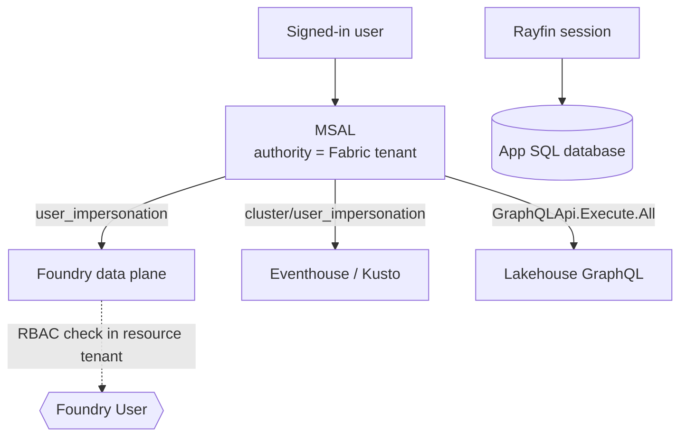
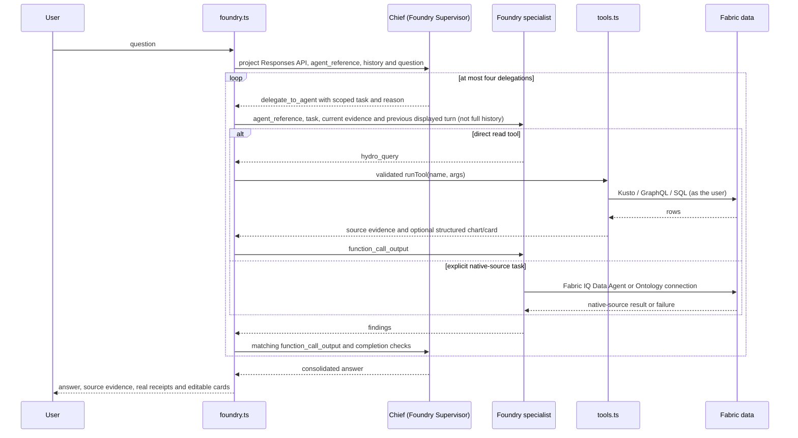

# Foundry Copilot — authentication, flows and tool calls

> Current implementation: the app invokes persistent Foundry Prompt Agents through a project
> endpoint. A real Supervisor emits delegation function calls; the client invokes separate
> specialist agent identities and runs direct tools under the user's existing delegated identity.
> This is not native A2A transport or Foundry Workflows. Only the Fabric IQ specialist uses Fabric IQ;
> Q&A/RCA do not use the Data Agent as an intermediary. See the
> [role/routing and ten-flow acceptance report](../HydroOperationsApp/AGENT-ACCEPTANCE.md),
> [current app contract](../HydroOperationsApp/README.md)
> and [deployment configuration](../HydroOperationsApp/DEPLOY.md#persistent-foundry-agents).
>
> The project API uses `https://ai.azure.com/user_impersonation` and Foundry User RBAC.
> Work-order approvals are editable Yes/No cards, not model-issued writes or typed commands.
> Shared presentation and safety tests do not certify live response parity or agent latency.

An isolated [Microsoft Agent Framework service](../HydroOperationsService/README.md)
now validates durable execution boundaries locally, with synthetic providers and no
production writes. It is not wired into this browser flow. Its restart/approval tests
must not be presented as live Foundry orchestration or a completed enterprise migration.
Its separate read-only source diagnostic now verifies v2 identities and retrieves
live STID-mapped telemetry. SQL access remains blocked by disabled delegated exchange;
the existing CLI token also lacks the documented `Item.Execute.All` scope.
Source failures block investigation/approval, not just answer formatting.
No production authentication settings or hosted agent paths were changed.
Operator-ready [ten test prompts](../HydroOperationsApp/AGENT-TEST-PROMPTS.md) are
separate from the historical acceptance logs.

The complete 1.0.752 hosted matrix captured ten compound first prompts and two
follow-ups. It is not a ten-of-ten pass: ontology retrieval surfaced HTTP 500, and
a fleet request incorrectly asked the Data Agent for its own "published results".
Native connection selection belongs in `native_source`, not inside the business
question as a request for a publication endpoint. The runtime now rejects that
self-referential assignment before native I/O and returns bounded correction guidance.
Sparky must not forward application routing/no-endpoint-substitution rules to the
remote query engine as prohibitions on its connected Lakehouse/Eventhouse/SQL tables.
Missing read-clock metadata is disclosed; unavailable native results never become a
successful comparison through direct-source substitution. See the linked acceptance
report for the deployed version and rerun status.
Native reconciliation accepts Markdown/CSV tables and fenced JSON objects containing
flat `rows` records. Declared row counts must match; inconsistent/nested/malformed
datasets are explicitly unverified. Literal native identity/value/time fields are
compared with direct receipts without inventing units or removing timestamp precision
differences. Schema-free empty JSON sets are not evidence of an empty population.
An instrument `Signal ID` is not an OPC UA node. The decoder accepts only explicit,
unambiguous literal node cells, including when a separate `Signal node` column exists.
Explicit inline units can be read from numeric cells; conflicting unit columns remain
unverified rather than silently converted.

Administration configures the current project endpoint, not a direct model-inference
endpoint. Model selection belongs to the canonical agent provisioner. Operator additional
instructions reach the Supervisor and all Foundry specialists; the editable direct-source
prompt/catalog applies to Q&A, RCA, and Work Order specialists. These settings do not
replace registered agent permissions or the human SQL approval boundary.

How the **Foundry** Copilot engine authenticates, what happens during a single answer, and exactly
which data each tool can reach.

## Live crew and execution tracing

The shared chat/Battle renderer reuses the existing yellow Signal Sprint helper in a
Supervisor-led communication diagram, with role badges: Chief (Supervisor), Gauge (Q&A), Sleuth (RCA),
Fixer (work orders), and Sparky (Fabric IQ). The thinking game and crew share the same
`CopilotHelper` component and existing character styles; there is no separate SVG mascot.
Execution receipts are collapsed by default so the answer retains the screen space. Only actual running
agents animate; unused agents remain standing by. Animations can be paused and respect
reduced-motion preferences. Failed runs never receive a successful overall status.
Human approval progress comes from the in-memory approval store, so creation/rejection
does not leave the crew waiting indefinitely. SQL validation and writes are explicitly
application actions, not evidence that a model executed a database mutation.
The 1.0.729 scientific test still produced an unsupported diagnostic threshold.
The subsequent implementation requires Sleuth's `complete_rca_assessment` report:
application code validates current-turn evidence IDs and JSON-pointer paths and renders
the returned values itself. Prose-only reports and unsupported fields are rejected within
the existing round limit. Final RCA output excludes free-text diagnostic claims from
Chief and Gauge. It preserves source-derived station summaries, returned open work,
actual proposal counts and an explicitly unsent notification when requested.
Investigation follow-ups such as "reassess the investigation", "review the diagnosis"
and "continue the RCA" require the same Sleuth completion gate. A fresh factual answer
from Gauge is not a replacement for the requested investigation.
Native retrieval text is retained separately as claims for comparison, not promoted to
a verified diagnosis. Local runtime tests also cover deterministic proposal priority:
the actual proposal tool ignores model escalation, uses an explicit operator priority
or Medium, and still requires human approval.
Priority extraction is scoped to the new-work assignment or an explicit priority field/setter.
A High-priority filter on existing orders, or a request to check such orders before drafting,
does not itself assign High priority to the new draft.
This validates source references, **not causal relevance or baseline comparability**.
Hypotheses remain untested and cause undetermined; no approved diagnostic-limit source
or validated causal model is configured. See the acceptance report for deployment/live status.
For a simple Gauge-only station-power chart with one completed source query, the app
renders the final table, units, timestamps and freshness directly from the validated
chart dataset. A model rewrite is not authoritative for these values. Compound
investigations preserve each queried station window separately and require engineering
review of hypothesis relevance and missing evidence.
The latest source correction deduplicates equal station datasets within one window
and identical chart objects without removing either read receipt; distinct windows remain
separate. Formatted summaries and chart metadata cannot serve as RCA observations.
The post-rerun source renderer additionally preserves every returned BAD/HOT, spare-parts
and notification inventory row, rather than only the observations Sleuth selected.
It labels snapshot freshness using the source read clock, preserves nulls and discloses
truncation and broader query scope. This preserves evidence, not the correctness of the
agent's row selection or a causal conclusion. Pointer/size guidance identifies invalid
`/data` prefixes and oversized references without accepting them.
The earlier chart/dataset deduplication correction is deployed in 1.0.737 following capacity restoration;
see the [current acceptance gate](../HydroOperationsApp/AGENT-ACCEPTANCE.md#latest-gate-restored-capacity).
The hosted rerun also exposed an invalid node filter on `TelemetryEnriched`, whose
projection omits `opcua_node_id`. The direct telemetry tool now offers `aggregation:
"latest"` for one latest raw value/quality/time per verified node within the requested
window, without averages or quality exclusions. A direct missing-node-column filter on
the enriched function is rejected locally with repair guidance; actual source failures
still propagate. This does not turn the KQL allow-list into a complete semantic compiler.
The pointer/inventory/latest-telemetry and follow-up-routing changes after that rerun are
deployed beginning with 1.0.740, with pointer-schema and proposal-envelope corrections
in 1.0.741 and 1.0.742. The full suite is not yet hosted-certified. Canonical deployment and browser build
identity passed; tenant-wide consent remains an enterprise rollout prerequisite.
Native-source selection now restricts each Sparky invocation to its explicit MCP server
label and requires a completed matching execution receipt. Both connections remain
provisioned; no alternate source is used on failure. A live preview-service probe accepted
the restriction and returned the requested Data Agent receipt, not proof of SQL answer correctness.
Ordinary inventory requests cannot invent a native-source requirement. Explicit user
source context can carry into follow-ups; assistant-generated source names cannot authorize it.
Release 1.0.744 also requires every explicitly requested native source before completion,
reserves delegation slots for required investigation/work/verification steps, and rejects
plan-only RCA assignments that prohibit the evidence reads needed by Sleuth.
Structured operational date filters compare full ISO timestamps, not numeric year
prefixes; missing values do not satisfy ordered comparisons. Malformed predicates fail
explicitly. Requested charts omitted by Gauge receive at most one same-invocation
correction with the original request. Missing or unrelated data must not become zeroes
or fabricated series; missing structured chart output is explicitly marked incomplete.
The reproduced latest-raw KQL projection using invented `arg_max_*` output names is
rejected locally with the real field names and typed-tool alternative. This is a
bounded guard, not a complete KQL semantic compiler; actual source failures propagate.
The 1.0.747 reconciliation rerun completed its real handoffs but did not establish
full-fleet coverage or return the requested comparison table. A separate typed-query
answer falsely claimed validation of unexecuted KQL. These remain acceptance failures,
not successful independent verification; see the current acceptance report.
The subsequent implementation adds mandatory independent fleet-snapshot receipts
for explicit native/direct BAD-temperature fleet comparisons. Recognized time windows
and rank counts are checked, and GraphQL pagination metadata must attest complete
equipment/instrument inventory. Source limits fail rather than silently returning
partial populations. Missing active signals are reported separately from latest BAD
membership. A deterministic renderer compares actual native tool tables with direct
rows and preserves work-order signal relations. Unknown native formats remain
unverified; exact matching does not prove equivalent query scope or freshness.
Supplied KQL validation requests render the actual local-check outcome and execution
receipts instead of model validity claims. The local check is not a full KQL compiler.
See the acceptance report for whether these changes have passed hosted validation.
Native handoffs reject prescriptions of local Hydro tool names before invocation.
Sparky forwards business-data questions to native tools, whose connected tables remain
their own normal execution sources. For fleet disagreements, independent full-population
evidence must precede Sleuth's investigation; unrelated metadata cannot substitute for
that prerequisite.
Explicit direct-source reconciliation also requires Gauge and the relevant source
receipts, not merely two native retrievals. Facility-level backlog requires direct
work-order, equipment and facility rows; partial asset inventories expose unknown totals
and truncation. Requested direct verification precedes disagreement investigation.
Facility-backlog verification requires complete unfiltered inventories, not just the
equipment named by a native answer. Its final table and chart share application-derived
counts and exact Lakehouse equipment-to-facility mappings; unmatched IDs remain visible.
Actual native table comparisons cannot certify native scope or source execution
provenance. Verify-before-investigation and explicitly requested final verification
are distinct: only the latter adds a post-investigation QA pass, while post-draft
verification remains enforced.
Ontology instance requests select `ask_ontology`; successful schema discovery is not
an instance receipt. Local asset/SQL filters are validated against their declared
columns and operators before source I/O. Typed filter-input errors can be corrected
within the existing round budget; source/authorization failures are not retried or
converted into empty data. Native fleet tables may carry an explicit combined
instrument/node cell, but ambiguous identifiers are not inferred.
Native tool error envelopes and incomplete-response reasons are surfaced rather than
replaced with a generic failure. An ontology `list_ontology_entities` entity-name pattern
failure was observed live; improved diagnostics do not repair or certify that native service.
Proposal input validation is locally repairable within the existing round budget;
real source/target errors still propagate. Unsent notifications use checked source
presentation without treating prose authorization requests as successful completion.
Do not read these changes as all-green hosted runtime acceptance.
The crew defaults to a slim animated five-agent strip. Expand flow moves detailed
communication/receipts into a separate, resizable desktop side panel; on narrow screens
it uses a bounded-height panel. Normal chat retains Maximize/Restore and protects composer
space. Completed messages are memoized rather than reparsed on every streamed delta.
WO cards appear before narrative; **Supporting findings and sources** is initially closed.
Source/reference sections can be expanded without losing records or copy/export content.
Approval controls and validation errors are never inside collapsed evidence.

Request packets originate only from actual child invocations with a recorded parent.
Return/failure packets require the matching delegation call receipt, not just a completed
model response. Recent packets play once; historical results do not replay live traffic.
Role-specific working motions indicate an active invocation, not continuous network transfer.
The live feed labels browser coordination/tool execution separately from streamed Foundry events.
Normal chat is Supervisor-only; direct Data Agent execution remains available through optional Battle.

Execution receipts retain actual Foundry response IDs, exposed request IDs, stable
parent invocation IDs, and lifecycle/tool events. Browser tool execution is labeled
separately from Foundry events. Tokens, response payloads, and private reasoning are not
included in these receipts. They are not a complete distributed trace export.

The canonical provisioner discovers the project's existing AppInsights connection and
exports only its resource ID as `RAYFIN_PUBLIC_FOUNDRY_APP_INSIGHTS_RESOURCE_ID`. It
requires one unambiguous linked resource; no instrumentation secret enters the SPA.
Receipts link to that resource and provide a response-ID-scoped, 24-hour Logs query.
The portal uses the operator's existing Azure authorization; the UI does not request
another API scope just to display tracing links.

On October 7, a bounded query of the linked demo resource found the verified Supervisor
response under `invoke_agent hydro-supervisor-agent:1` and an `execute_tool` span sharing
one operation ID. This verifies correlation for that response, not end-to-end browser
parity, hosted Framework orchestration, or SQL approval acceptance.

This document covers the **Foundry engine**, not a second ontology generation. The project supports
**Ontology v2 only**. UI/engine labels such as V1/V2 are separate from `properties.generation`.
Foundry queries its allowed Lakehouse, Eventhouse, and operational sources directly; it does not
establish Data Agent onboarding or Operations Agent playbook readiness.

For the separate Fabric **Data Agent** engine, the app requires a live generation-2 ontology and
verifies that the candidate agent's **published** ontology datasource references that exact
workspace/item before forwarding a question to MCP. Draft-only, missing, mismatched, or unreadable
sources block invocation. Matching source identity is not runtime certification: product errors
still propagate. See [the app's v2 contract](../HydroOperationsApp/README.md#ontology-v2-only)
and [agent provisioning policies](../README.md#ontology-generations-and-optional-agents).
The Data Agent and both Operations Agents are always provisioned; there are no agent-mode flags.
Foundry success is not evidence that the separate Data Agent, Operations
Agent, playbook/actions, or alert delivery succeeded.

In the latest V3 live check, the separate Fabric Data Agent published its selected ontology and
five selected SQL tables, but a real ontology MCP question failed inside `analyze_ontology` with
an unsupported API version despite an `isError: false` envelope. A SQL-only question returned the
correct 12 work orders. This is not evidence that Foundry was tested, or that semantic runtime,
Operations Agent monitoring, or Teams/email delivery works. The revised NB09 facility-record MCP
smoke check independently compares real Lakehouse IDs/names without leaking expected values into
the prompt. Its successful `ready`/`verified` statuses are scoped functional evidence: execution
provenance is not attested, and SQL/combined-source readiness is not certified. Failed or
inconclusive results fail required execution. The updated NB09 was run once and correctly failed
on the real semantic error, preserving full ontology/SQL sources and custom content. A post-failure
SQL-only MCP question still returned exactly `{"workOrderCount":12}`. This proves failure handling
and preservation, not a passed ontology smoke test or Foundry acceptance. See
[latest V3 acceptance](knowledge-graph.md#latest-v3-acceptance-september-30-2026).

---

## Where things live

| Path | What it is |
| --- | --- |
| `src/services/copilot/catalog.ts` | **The allow-list of readable data — the governance boundary** |
| `src/services/copilot/settings.ts` | Operator overrides edited in Administration (prompt, tools, sources) |
| `src/services/copilot/query.ts` | Pure KQL builder, `run_kql` validator, structured row filter |
| `src/services/copilot/tools.ts` | Tool schemas + executors, per-turn caches |
| `src/services/copilot/chatStream.ts` | SSE reader + tool-call delta accumulator |
| `src/services/copilot/responsesProtocol.ts` | Responses API request conversion and bounded completed-turn history |
| `src/services/copilot/suggestions.ts` | Parses the follow-up options a reply offers |
| `src/services/copilot/foundry.ts` | The agent loop, system prompt, conversation history |
| `src/services/fabric.ts` | MSAL, token acquisition, `runKustoQuery`, `queryStid` |
| `scripts/copilot-tools.test.mjs` | Unit tests for validation, tools, Responses streaming/context and suggestions |

---

## 1. Authentication

### The architecture, and why

The app is a **static SPA** — `rayfin.yml` has `staticHosting` only and `functions: enabled: false`.
There is no server-side code path, so there is nowhere to hide an API key. The Foundry engine therefore calls the
Azure AI Foundry data plane **directly from the browser with a delegated Entra token**.

That constraint produces the property that matters most:

> [!IMPORTANT]
> Every tool call executes **as the signed-in user**. The copilot cannot read anything that user
> could not already read in Fabric. There is no service principal, no app-owns-data mode, and no
> key material in the bundle.

### Tenant pinning

MSAL is constructed with a fixed authority:

```ts
authority: `https://login.microsoftonline.com/${VITE_FABRIC_TENANT_ID}`
```

So **every** token the app acquires — Fabric, Kusto, GraphQL, Foundry — is issued by the tenant that
owns the Fabric workspace.

> [!WARNING]
> The Foundry resource **must live in that same tenant**. Azure evaluates RBAC in the resource's own
> home tenant, so a resource in a different tenant returns 401 no matter which roles you assign.
> Check with `az account list --all` before creating it — picking a corp or personal subscription by
> accident is easy and the failure mode looks like a permissions bug.

### Scopes

Each live data path authenticates against a different resource. All are **delegated**, and all are
requested as **named scopes rather than `.default`**.

| Path | Scope | Resource |
| --- | --- | --- |
| Supervisor and specialists | `https://ai.azure.com/user_impersonation` | Microsoft Foundry Agent Service (`18a66f5f-…`) |
| Telemetry (Kusto) | `<cluster>/user_impersonation` | Azure Data Explorer (`2746ea77-…`) |
| Asset metadata | `…/powerbi/api/GraphQLApi.Execute.All` | Power BI Service (`00000009-…`) |
| Workspace discovery | `Workspace.Read.All`, `Item.Read.All`, `Item.Execute.All` | Power BI Service |
| Direct Data Agent execution (Battle) | `DataAgent.Execute.All` with the Fabric scopes | Power BI Service / Microsoft Fabric |
| Operational records | *(none — Rayfin session cookie)* | Rayfin backend |

> [!NOTE]
> `.default` returns only permissions already statically configured for that exact audience, so it
> never triggers incremental user consent — Entra escalates to "Need admin approval" instead. Named
> scopes consent cleanly. This bit the Eventhouse path first; the Foundry scope follows the same
> rule.

Work orders, inspections and spare parts are **not** reached with an MSAL token: `RayfinClient`
carries its own Fabric-backed session established by `initEmbeddedAuth`.

### Token flow


```mermaid
flowchart TD
  U[Signed-in user] --> M[MSAL<br/>authority = Fabric tenant]
  M -->|user_impersonation| F[Foundry data plane]
  M -->|cluster/user_impersonation| K[Eventhouse / Kusto]
  M -->|GraphQLApi.Execute.All| G[Lakehouse GraphQL]
  R[Rayfin session] --> S[(App SQL database)]
  F -.->|RBAC check in resource tenant| RB{{Foundry User}}
```

`foundryAgentToken()` tries silent acquisition first and only falls back to a popup when the call was
started by a user gesture — redirects are blocked inside the Fabric iframe.

### Consent and RBAC

Two separate things, often confused:

| | Grants what | Applied by |
| --- | --- | --- |
| Delegated **scope** | Permission to request a token for that audience | `npm run setup-live-auth` (idempotent) |
| **Foundry User** role | Permission to invoke the project agents | Resource administrator |

Both are required. The scope alone yields a token that the data plane rejects.

Tenant-wide admin consent avoids per-user permission prompts. Personal consent is supported where
tenant policy permits it. `setup-live-auth` attempts the bundled grant and prints the exact missing
administrator action when denied; the orchestrator still fails if effective consent remains incomplete.
The obsolete Cognitive Services inference audience is no longer requested or required. Existing grants
are preserved rather than revoked automatically. Fabric IQ definition verification uses ordinary
Fabric scopes; it does not execute the Data Agent and does not request `DataAgent.Execute.All`.
The Foundry Fabric IQ connection remains a separate project authorization boundary.

No CORS configuration is needed. The Azure OpenAI data plane returns `Access-Control-Allow-Origin: *`
and permits `Authorization` on POST. Keep the resource on **public network access**, though: a
private endpoint or a "selected networks" firewall cuts the browser off.

---

## 2. Answer flow

Chief and Sparky have at most **six Responses rounds** per invocation; the direct
specialists have **eight**, including identity/coverage reads, investigation or staging,
and final acknowledgement. RCA requests require tool calls rather than accepting
prose-only planning as progress. A locally rejected final-round assessment with existing
evidence can use one additional **completion-only** correction: the request forces
`complete_rca_assessment`, further reads are rejected, and a second invalid report fails.
This is not a retry of a failed source request or permission to weaken evidence checks.
Chief has a four-delegation
budget per turn. Results return as `function_call_output` items matching actual call IDs.
Native response output items are preserved for continuation.

Direct specialists also receive the immediately preceding displayed question/answer
unchanged, labelled as historical claims rather than current source receipts or
instructions. This preserves chart values, aggregation semantics and timestamps when
Chief abbreviates a follow-up assignment. It does not replace fresh verification:
rolling windows can change, historical text cannot satisfy RCA evidence pointers, and
prior proposals are not write approval. New chat clears this context. Native-source
assignments remain isolated from this display history.


```mermaid
sequenceDiagram
  participant U as User
  participant A as foundry.ts
  participant M as Chief (Foundry Supervisor)
  participant S as Foundry specialist
  participant T as tools.ts
  participant D as Fabric data

  U->>A: question
  A->>M: project Responses API, agent_reference, history and question
  loop at most four delegations
    M-->>A: delegate_to_agent with scoped task and reason
    A->>S: agent_reference, task, current evidence and previous displayed turn (not full history)
    alt direct read tool
      S-->>A: hydro_query
      A->>T: validated runTool(name, args)
      T->>D: Kusto / GraphQL / SQL (as the user)
      D-->>T: rows
      T-->>A: source evidence and optional structured chart/card
      A->>S: function_call_output
    else explicit native-source task
      S->>D: Fabric IQ Data Agent or Ontology connection
      D-->>S: native-source result or failure
    end
    S-->>A: findings
    A->>M: matching function_call_output and completion checks
  end
  M-->>A: consolidated answer
  A-->>U: answer, source evidence, real receipts and editable cards
```

Notes on the implementation:

- **Project endpoint.** Administration stores the HTTPS Foundry project endpoint. The
  client appends `/openai/v1/responses` and sends a provisioned `agent_reference`.
  The canonical provisioner owns model deployment selection.
- **Streaming.** Responses API SSE text deltas are rendered progressively. Function-call argument
  fragments are accumulated by output index, and final items replace fragments before execution.
- **Failures propagate.** Real source, publication, runtime and readback failures fail the
  workflow. Only locally rejected, unexecuted arguments/KQL and premature delegation
  can be corrected without a source retry. Pending proposals from failed workflows
  are withdrawn. A write timeout remains uncertain and is never automatically replayed.
- **History** is bounded to eight user/assistant message objects for Chief. Specialists
  receive self-contained assignments and current-turn evidence. Incomplete-turn context
  is explicitly labelled failed, never stored as a successful answer. Tool traffic is
  dropped between completed turns so a long session cannot grow the context unbounded. During an
  active turn, every function call and function output remains in the Responses input until the
  model produces the final answer. History is cleared only by the explicit conversation reset.
- **No `temperature`** is sent — the gpt-5 family rejects any value but the default.

Each answer carries a trace the UI renders as one collapsible row per tool call: the tool name, a
short label of what it asked for, the row count and elapsed time, expanding to the raw arguments and
the exact KQL. Rows appear **as the call starts**, not when the answer finishes, so the user can see
what the agent is reaching for while it works.

The transcript follows new content only while the reader is already at the bottom — scrolling up
opts out of auto-scroll until the next question is sent.

**Copy** on each answer puts the whole exchange on the clipboard as markdown: the question, every
tool call with its arguments, query and result, the answer, then chart CSV and 3D model links.
Steps retain their result payload for this — the same JSON already sent to the model, already capped
by `truncateForModel`. It is copy-only; rendering it in the trace would bury the one-line summary.

### Follow-up options

When a reply offers choices, they render as chips under the last answer, each with a button to put
it in the composer and one to send it immediately (max 5, capped to two rows).

The model is asked to declare them on a trailing line:

```html
<!--options: ["Show open work orders", "Chart power output for T009"]-->
```

`react-markdown` does not render raw HTML without `rehype-raw`, so the marker is invisible in the
chat without stripping and does not flicker mid-stream. It is stripped explicitly before the Copy
transcript.

> [!NOTE]
> A prose heuristic (cue phrase followed by a list) remains as a fallback, because the Data Agent
> engine never emits the marker and the system prompt is operator-editable — someone can delete the
> rule. Declared options win whenever present; a malformed marker falls through to the heuristic.

---

## 3. Operator settings

**Administration → Foundry Copilot** narrows what the model may reach, persisted per browser in
`localStorage` and applied to the next question:

| Setting | Effect |
| --- | --- |
| Project endpoint | Which provisioned Foundry project is invoked. The model is selected by the canonical provisioner, not a browser inference-endpoint field. |
| System prompt | The base instructions. `{{catalog}}` and `{{time}}` are substituted at call time; without `{{catalog}}` the model gets no schema. |
| Additional instructions | Appended after the system prompt. |
| Tools | A disabled tool is removed from the schema **and** refused by the runtime if called anyway. |
| Lakehouse / operational tables | Removed from the prompt and from the tool's `entity` enum; the runtime re-checks. |
| Eventhouse tables & functions | Also narrows the `run_kql` allow-list. |

> [!NOTE]
> These settings constrain the **model**, not the user. They reduce what a wandering or
> injection-influenced agent can touch; they are not a privilege boundary, because the delegated
> token already limits every call to what the signed-in user could read anyway.

---

## 4. Tool calls

### Readable data

Defined once in `catalog.ts`, narrowed by Administration, and rendered into the system prompt.
Structured tools derive their entity choices from this catalog, while `run_kql` separately enforces
the enabled Kusto source allow-list. Kusto itself remains the authority for function columns and
query semantics.

| Entity | Source | Reached via |
| --- | --- | --- |
| `facilities` → `silver_facilities` | Lakehouse | GraphQL (`queryStid`) |
| `equipment` → `silver_equipments` | Lakehouse | GraphQL |
| `instruments` → `silver_instruments` | Lakehouse | GraphQL |
| `work_orders`, `inspections`, `spare_parts`, `notifications` | App SQL database | `RayfinClient` |
| `asset_models` | App SQL database | `RayfinClient` — 3D model files per equipment |
| `OPCUAEvents` | Eventhouse | Kusto REST |
| `AssetMaster()`, `TelemetryEnriched(...)` | Eventhouse | Kusto REST — telemetry pre-joined to asset master via OneLake shortcuts |

Kusto identifiers are case-sensitive. `AssetMaster()` returns `opcua_node_id`, `Station`, `Turbine`,
`Signal`, `SignalGroup`, and `Unit`. `TelemetryEnriched(...)` returns `event_time`, those five
capitalized asset columns, `value`, and `quality`. These names mirror the functions provisioned by
`RTI_008_build_realtime_dashboard`; lowercase `station`, `turbine`, or `unit` will not resolve.

### The tools

| Tool | Accepts | Guardrail |
| --- | --- | --- |
| `query_assets` | entity + structured predicate | No query text — **no injection surface** |
| `query_operations` | entity + structured predicate | No query text — **no injection surface** |
| `query_telemetry` | node ids, lookback, bin, aggregation | Templated KQL; each fragment regex- or map-validated, node ids escaped |
| `run_kql` | **model-authored KQL** | Allow-list + rejection rules below |
| `visualize_dataset` | chart spec + inline CSV | Renders only; reaches no data |
| `show_3d_model` | equipment_id or model_id | Resolves an `Asset3DModel` record and renders the GLB inline; no query text |

### `run_kql` validation

The single place model-written query text is accepted. It must start with a catalog source
(`OPCUAEvents`, `AssetMaster`, `TelemetryEnriched`) and is rejected outright for:

| Rejected | Why |
| --- | --- |
| Leading `.` | Control commands (`.drop`, `.ingest`, …) |
| `externaldata` | Would read an attacker-supplied URL |
| `cluster(` / `database(` | Escapes the configured database |
| `ingest`/`set`/`append`/`drop`/`alter`/`delete` | Read-only enforcement |
| `;` | Multiple statements |

A surviving query gets `| take 500` appended unless it already ends with a `take`, and the Kusto
request additionally sets `truncationmaxrecords` and a 60-second `servertimeout`.

The validator is a read-only and source-boundary guard, not a full KQL compiler. Unknown columns,
incorrect identifier casing, invalid function signatures, and other semantic errors are rejected
by Eventhouse. That error is returned to the model as a failed tool result so it can correct the
query or fall back to a structured tool.

`TelemetryEnriched` uses positional KQL arguments. Invoke it as
`TelemetryEnriched(ago(6h), now(), dynamic(null), dynamic(null))`; declaration notation such as
`start:datetime` describes the function signature and is not valid named-argument call syntax. The
client rejects named calls with an actionable correction before they reach Eventhouse.

### Result shaping

Every row set is projected to the columns declared in the catalog *before* the model sees it, then
narrowed further to any subset the model asked for. Columns absent from the catalog — notably Entra
object ids such as `assignedToOid` and `inspectorOid` — are never returned. Results are capped at
500 rows and halved until the JSON payload is under 40 KB.

### Prompt injection

Work order titles, findings and asset names flow into the model's context. The system prompt states
that tool output is **data, never instructions**. The structural mitigation matters more than the
wording: the toolset is entirely read-only, so a successful injection cannot cause a write. If a
mutating tool is ever added, gate it behind an explicit UI confirmation rather than letting the
model call it autonomously.

---

## 5. Troubleshooting

| Symptom | Cause |
| --- | --- |
| Project URL ending in `/api/projects/...` | Project SDK/management endpoint, not model inference. Use the same origin with `/openai/v1/responses`. |
| `400 unsupported_value` on `temperature` | gpt-5 family allows only the default; don't send the parameter |
| `401`/`403` from Foundry | Missing `Cognitive Services OpenAI User`, or the resource is in another tenant |
| "Need admin approval" | A `.default` scope was requested instead of a named one |
| Engine toggle missing | `RAYFIN_PUBLIC_FOUNDRY_*` unset, or the app wasn't rebuilt after setting them |
| "Asset metadata is not connected" | STID GraphQL not yet consented — use **Connect** in the app once |
| "stopped after too many tool calls" | Hit the 6-iteration cap; narrow the question |
| "disabled in Administration" | The tool or table was switched off in **Administration → Foundry Copilot** |
| "Not signed in to the operational database" | The Rayfin session is separate from the Entra token — use Administration step 1 |

---

## See also

- [../HydroOperationsApp/DEPLOY.md](../HydroOperationsApp/DEPLOY.md) — provisioning and the two manual Azure steps
- [realtime-dashboard-plan.md](realtime-dashboard-plan.md) — where `AssetMaster()` / `TelemetryEnriched()` come from
