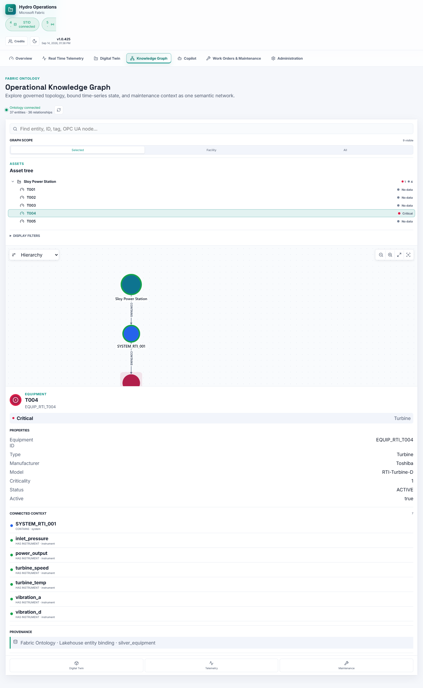
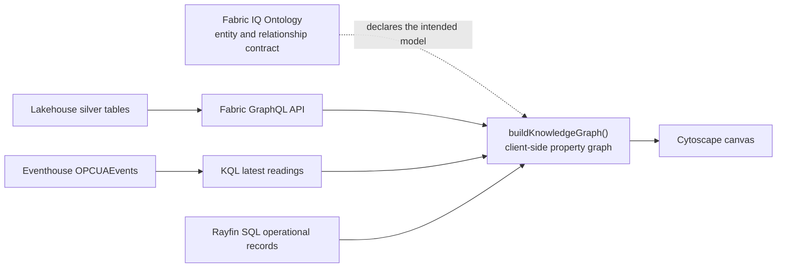
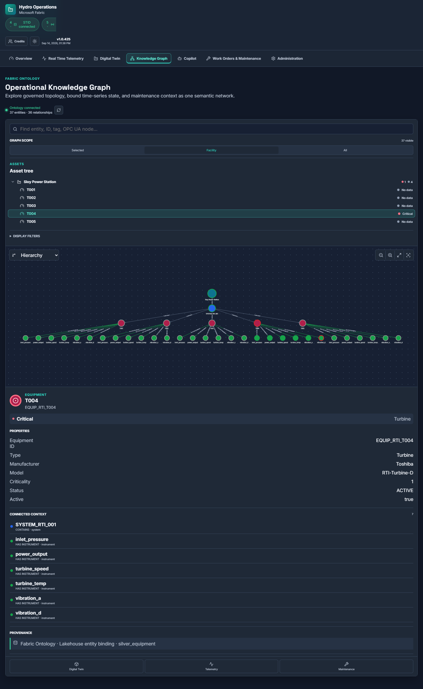

# Hydro Operations Knowledge Graph

## Purpose

The Knowledge Graph turns asset topology, live telemetry, and maintenance records into one
navigable operational context. It is designed for an operator who starts with a turbine or issue
and needs to move quickly between the affected facility, system, equipment, instruments, current
readings, inspections, notifications, work orders, and 3D model.

The graph is not a replacement for the Fabric IQ Ontology, Real-Time Dashboard, or SQL system of
record. It is an application view that composes those governed sources and preserves their
provenance.



> [!NOTE]
> Screenshots in this document use the repository's synthetic STID fixture and cached telemetry so
> they are deterministic and contain no customer data. A live session shows the same interface with
> values loaded from the configured Fabric workspace.

## Useful scenarios

| Scenario | How the graph helps |
|---|---|
| Alarm and anomaly triage | Start from a critical signal, identify its instrument and turbine, then open telemetry or maintenance without losing selection. |
| Maintenance planning | See open work, notifications, inspections, and available model context around one asset instead of reconciling identifiers across screens. |
| Root-cause exploration | Traverse the governed signal-to-instrument-to-equipment-to-system-to-facility path and compare sibling context. |
| Shift handover | Share a compact facility or selected-asset context with health and provenance visible in one view. |
| Data-quality investigation | Distinguish critical operating state from uncertain quality, stale readings, and missing data. |
| Engineering impact analysis | Inspect which operational records and signals are connected before changing an asset, system, or instrumentation model. |
| AI grounding and audit | Use the same stable IDs and semantic relationships that ground the Fabric Data Agent, while retaining the source of each visual node and edge. |

## What exists in Fabric

The authoritative semantic asset is built before the app runs:

1. `RTI_004_build_ontology_mapping_rti_structured` creates five Fabric IQ Ontology entity types,
   four relationship types, and time-series properties.
2. `RTI_005_entity_DataBinding_rti_structured` adds static Lakehouse data bindings and relationship
   contextualizations.
3. `RTI_006_TimeSeriesBinding_RTI_signal` binds Eventhouse `OPCUAEvents` observations to
   `signal_master`.
4. `RTI_009_build_data_agent` publishes the Ontology as a Data Agent source.
5. `RTI_011_seed_sql_wire_graphql_agent` creates the app-facing GraphQL API and adds Rayfin SQL as
   another Data Agent source.

The governed semantic path is:

```text
signal_master -> instruments -> equipment -> systems -> facilities
```

There is no separate Fabric Graph item in this repository. "Graph" refers to the entity and
relationship network defined by the Fabric IQ Ontology and visualized by the application.

## Current application implementation

The current SPA is **Ontology-aligned**, but it does not yet query Ontology instances as a graph:



`queryStid()` reads facilities, equipment, and instruments from Lakehouse GraphQL. Latest
Eventhouse readings are joined to instruments by `opcua_node_id`. Rayfin SQL records are joined by
`equipmentId`, `instrumentId`, or `opcuaNodeId`. `buildKnowledgeGraph()` creates Cytoscape nodes and
edges, including an inferred system node for each `facility_id` and `system_id` pair.

This design was chosen because Fabric Ontology `getDefinition` exposes the model and bindings, not
a bulk instance-graph response suitable for the browser. The already provisioned GraphQL and KQL
surfaces provide deterministic instance reads. The tradeoff is important: the current graph
reconstructs relationships from governed keys instead of consuming the live Ontology definition as
its runtime contract.

## Interaction model

The left asset tree and graph share the same selected facility and turbine state used by Overview,
Real-Time Telemetry, Digital Twin, and Maintenance.

| Scope | Visible context |
|---|---|
| Selected | The selected turbine, its instruments and operational records, parent system, and facility. This is the default and minimizes clutter. |
| Facility | All graph entities associated with the selected facility. |
| All | Every loaded entity and relationship. Use for discovery and model inspection. |

Search and display filters further restrict entities by text, class, and operational state. Selecting
an equipment or instrument node updates the shared application selection. The inspector exposes
properties, bound readings, connected context, provenance, and links to Digital Twin, Telemetry, and
Maintenance.



## Identity, joins, and provenance

| Source | Graph content | Stable join |
|---|---|---|
| Fabric Lakehouse | Facilities, systems, equipment, instruments | `facility_id`, `system_id`, `equipment_id`, `instrument_id` |
| Fabric Eventhouse | Latest and historical telemetry | `opcua_node_id` |
| Rayfin SQL | Work orders, notifications, inspections, 3D models | `equipmentId`, `instrumentId`, `opcuaNodeId` |

Every node records source provenance. Cross-store referential integrity is conventional rather than
transactional: SQL cannot enforce a foreign key into Lakehouse or Eventhouse, so stable identifiers,
seed validation, and orphan checks are required.

## Health semantics

Operational health and entity type must use separate visual channels:

- red: active critical condition or `BAD` quality;
- amber: warning or `UNCERTAIN` quality;
- green: healthy and current;
- gray: no data, unavailable, or too stale to classify safely.

The current canvas uses entity-type fill colors and health rings. The intended refinement is for
health to be the dominant color while type is communicated by icon, label, shape, or a subtle badge.
Health should roll upward from signal to equipment, system, and facility using the worst active
descendant state. The inspector must explain why an entity is red, including the triggering signal
or operational record, source timestamp, quality, and provenance.

## Ontology-authoritative target

The next ingestion iteration should preserve the existing source transports while making the live
Ontology definition authoritative:

1. Discover the configured Ontology item and read its live definition.
2. Parse entity types, properties, relationship types, bindings, and contextualizations into a
   versioned semantic contract.
3. Query bound instances through supported GraphQL and KQL surfaces.
4. Materialize only entity classes and relationships declared by that contract; remove hard-coded
   or inferred topology when a contextualization is available.
5. Preserve Ontology entity and relationship identifiers on every graph element.
6. Attach Rayfin records as an explicit `hydro-operations` overlay with source and join provenance.
7. Detect contract drift and orphaned operational records before rendering.

This approach reuses the deployed Ontology without incorrectly treating `getDefinition` as an
instance-query API. Cytoscape remains a presentation layer, not the semantic source of truth.

## RDF and OWL export

Export should be generated from the Ontology contract plus resolved instances, never from canvas
position or transient filter state:

| Fabric concept | RDF/OWL representation |
|---|---|
| Entity type | `owl:Class` |
| Relationship type | `owl:ObjectProperty` |
| Scalar property | `owl:DatatypeProperty` |
| Entity instance | RDF resource with a stable IRI |
| Source/binding lineage | Named graph and PROV-O assertions |
| Sensor observation | SOSA/SSN observation where interoperability is required |

Use a stable namespace based on environment, Ontology, entity type, and entity ID. Keep Rayfin
operational extensions in a separate namespace. Turtle is the preferred review format; JSON-LD is
the preferred web interchange format. OWL export describes the schema, while RDF instance export
describes current entities, relationships, and optional observation snapshots.

## Validation

1. Connect STID and verify graph counts agree with the loaded facilities, inferred/deployed systems,
   equipment, instruments, and operational records.
2. Verify every edge references two existing nodes and every operational overlay record exposes its
   source join key.
3. Compare representative relationship paths with the `ontology_relationship_audit` output from
   RTI_004/005.
4. Select a turbine in Overview and verify Knowledge Graph restores it; select another turbine in
   the graph tree and verify all other operational tabs follow it.
5. Confirm Selected, Facility, and All scopes, search, type filters, and health filters work in light
   and dark themes at desktop and mobile widths.
6. Verify a `BAD` reading is critical, `UNCERTAIN` is warning, missing telemetry is no-data, and the
   inspector shows the evidence.
7. Run `npm run test:knowledge-graph`, `npm run typecheck`, `npm run lint`, and `npm run build`.

## Key implementation files

- [`HydroOperationsApp/src/services/fabric.ts`](../HydroOperationsApp/src/services/fabric.ts):
  GraphQL, KQL, workspace discovery, and Data Agent access.
- [`HydroOperationsApp/src/services/rayfin.ts`](../HydroOperationsApp/src/services/rayfin.ts):
  operational SQL access.
- [`HydroOperationsApp/src/ui-shared/knowledgeGraphModel.ts`](../HydroOperationsApp/src/ui-shared/knowledgeGraphModel.ts):
  current application-side graph construction and provenance.
- [`HydroOperationsApp/src/ui-shared/pages/KnowledgeGraphPage.tsx`](../HydroOperationsApp/src/ui-shared/pages/KnowledgeGraphPage.tsx):
  scope, filters, shared selection, and inspector.
- [`HydroOperationsApp/src/ui-shared/components/knowledgeGraph/KnowledgeGraphCanvas.tsx`](../HydroOperationsApp/src/ui-shared/components/knowledgeGraph/KnowledgeGraphCanvas.tsx):
  Cytoscape rendering and layouts.
- [`Notebooks/RTI_004_build_ontology_mapping_rti_structured.Notebook/notebook-content.py`](../Notebooks/RTI_004_build_ontology_mapping_rti_structured.Notebook/notebook-content.py):
  authoritative entity and relationship definitions.
- [`Notebooks/RTI_005_entity_DataBinding_rti_structured.Notebook/notebook-content.py`](../Notebooks/RTI_005_entity_DataBinding_rti_structured.Notebook/notebook-content.py):
  static bindings and relationship contextualizations.
- [`Notebooks/RTI_006_TimeSeriesBinding_RTI_signal.Notebook/notebook-content.py`](../Notebooks/RTI_006_TimeSeriesBinding_RTI_signal.Notebook/notebook-content.py):
  Eventhouse time-series binding.