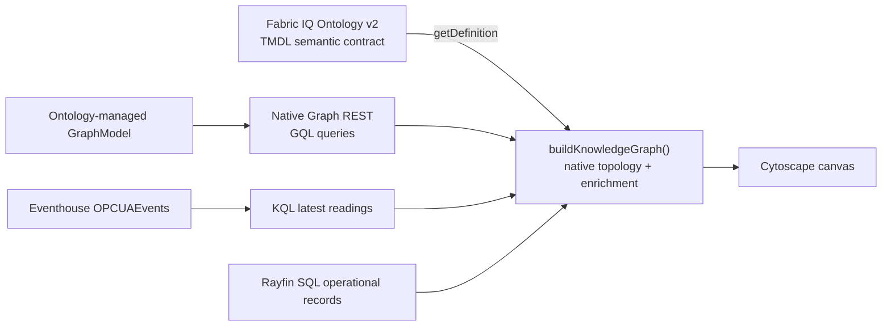

# Hydro Operations Knowledge Graph

## Purpose

The Knowledge Graph turns asset topology, live telemetry, and maintenance records into one
navigable operational context. It is designed for an operator who starts with a turbine or issue
and needs to move quickly between the affected facility, system, equipment, instruments, current
readings, inspections, notifications, work orders, and 3D model.

The graph is not a replacement for the Fabric IQ Ontology, Real-Time Dashboard, or SQL system of
record. It is an application view that composes those governed sources and preserves their
provenance.


> [!NOTE]
> Screenshots are historical UI illustrations using a synthetic STID fixture and cached telemetry,
> not evidence of native graph queries. Native-v2 live testing is in progress; no new successful
> native graph evidence or app deployment is claimed by this correction.

## Useful scenarios

| Scenario | How the graph helps |
| --- | --- |
| Alarm and anomaly triage | Start from a critical signal, identify its instrument and turbine, then open telemetry or maintenance without losing selection. |
| Maintenance planning | See open work, notifications, inspections, and available model context around one asset instead of reconciling identifiers across screens. |
| Root-cause exploration | Traverse the governed signal-to-instrument-to-equipment-to-system-to-facility path and compare sibling context. |
| Shift handover | Share a compact facility or selected-asset context with health and provenance visible in one view. |
| Data-quality investigation | Distinguish critical operating state from uncertain quality, stale readings, and missing data. |
| Engineering impact analysis | Inspect which operational records and signals are connected before changing an asset, system, or instrumentation model. |
| AI grounding and audit | Preserve stable IDs and semantic provenance that a supported, enabled v2 Data Agent can also use; current agent availability is independently gated. |

## What exists in Fabric

The authoritative semantic asset is built before the app runs:

1. `RTI_004_build_ontology_mapping_rti_structured` creates five Fabric IQ Ontology v2 entity types,
   four relationship types, and time-series properties.
2. `RTI_005_entity_DataBinding_rti_structured` adds static Lakehouse data bindings and relationship
   contextualizations.
3. `RTI_006_TimeSeriesBinding_RTI_signal` binds Eventhouse `OPCUAEvents` observations to
   `signal_master`.
4. `RTI_009_build_data_agent` publishes only a verified v2 Ontology as a Data Agent source when
   product support and the configured policy permit it; blocked onboarding is reported explicitly.
5. `RTI_011_seed_sql_wire_graphql_agent` creates the app-facing GraphQL API and adds Rayfin SQL as
   another Data Agent source when an agent is available. SQL/GraphQL provisioning does not require
   a Data Agent.

The governed semantic path is:

```text
signal_master -> instruments -> equipment -> systems -> facilities
```

**This project requires Ontology v2.** Existing generation-1 items are rejected, not consumed through
a legacy parser or used as agent sources. Graph materialization is optional in the Fabric ontology
experience, but **required for this app's graph canvas, tree, and scopes**. Open the selected ontology,
choose **Manage graph → select eligible entities and relationships → Continue → Materialize**.
Use the resulting ontology-managed GraphModel, not an independently created look-alike graph.

Eligible graph sources require an entity key and a Delta or mirrored backing-table binding.
The multi-backing-table `signal_master` entity may be ineligible; select only eligible types.
Native instrument nodes can still receive KQL telemetry without materializing `signal_master`.
No published ontology-owned projection/materialization REST endpoint is established here: the
portal operation is a manual prerequisite, not an unattended deployment promise.

### Explicit graph binding

Configure `RAYFIN_PUBLIC_ONTOLOGY_GRAPH_BINDING` with the exact selected identities. In `.env`,
wrap the complete JSON value in **single quotes**:

```dotenv
RAYFIN_PUBLIC_ONTOLOGY_GRAPH_BINDING='{"workspaceId":"<workspace-guid>","ontologyId":"<ontology-guid>","graphModelId":"<managed-graph-guid>"}'
```

Optional `nodeTypes` and `edgeTypes` objects map aliases returned by `getQueryableGraphType` to
exact ontology type names or IDs when projected labels differ:

```dotenv
RAYFIN_PUBLIC_ONTOLOGY_GRAPH_BINDING='{"workspaceId":"<workspace-guid>","ontologyId":"<ontology-guid>","graphModelId":"<managed-graph-guid>","nodeTypes":{"<queryable-node-alias>":"<exact-ontology-entity-type-name-or-ID>"},"edgeTypes":{"<queryable-edge-alias>":"<exact-ontology-relationship-type-name-or-ID>"}}'
```

The single quotes are dotenv syntax, not part of the parsed JSON. They are essential when an exact
ontology name contains `#`: dotenv treats an unquoted `#` as the start of a comment, even inside
JSON double quotes, and would truncate the binding. Copy exact names/IDs from the contract and
aliases from live metadata; the placeholders above do not specify a naming convention.
Do not guess a namespace-label
delimiter: it is undocumented. Published REST metadata does not expose the ontology-to-graph
association, so this binding is an operator assertion established through the selected ontology's
Manage graph flow. Neither a matching name, a sole workspace graph, nor structural similarity
proves ownership. Live contract/type validation checks consistency, not ownership.

## Application implementation

The SPA uses the live Fabric IQ Ontology v2 definition for semantic metadata and its explicitly
bound native GraphModel for topology:


```mermaid
flowchart LR
   DEF["Fabric IQ Ontology v2\nTMDL semantic contract"]
   GM["Ontology-managed GraphModel"]
    EH["Eventhouse OPCUAEvents"]
    SQL["Rayfin SQL operational records"]
   GQL["Native Graph REST\nGQL queries"]
    KQL["KQL latest readings"]
   BUILD["buildKnowledgeGraph()\nnative topology + enrichment"]
    CY["Cytoscape canvas"]

   DEF -->|"getDefinition"| BUILD
   GM --> GQL --> BUILD
    EH --> KQL --> BUILD
    SQL --> BUILD
    BUILD --> CY
```

`queryOntologyContract()` requires generation 2 and reads TMDL entity/ontology-relationship parts.
Physical TOM relationships in `relationships.tmdl` are not semantic ontology edges.
`queryOntologyGraph()` verifies live numeric generation `2`, the live TMDL contract, configured
GraphModel metadata, queryable aliases, node/edge types, and relationship endpoints before accepting
native GQL results. `buildKnowledgeGraph()` preserves native topology and adds enrichment; it never
fabricates entities or governed edges from STID rows or foreign-key joins.

Relative to `/v1/workspaces/{workspaceId}/`, native reads use
`GET graphModels/{id}/getQueryableGraphType?beta=true` and
`POST graphModels/{id}/executeQuery?beta=true` with a `query` body. Query pagination follows opaque
string `result.nextPage` continuations without interpreting or reconstructing them. Query errors,
warnings, truncation, malformed responses, dangling edges, or limits exceeding **2,000 nodes /
4,000 edges** fail closed; a partial result is never presented as a complete graph.

For page-load performance, Cytoscape is route-lazy and
single-flight requests prevent duplicate calls. The page defaults to a selected-asset projection;
facility and all-graph views are opt-in. Cytoscape reconciles changed element data in place, so live
polls preserve the current viewport, selection, and dragged node positions instead of rebuilding
the graph. A layout is rerun only on initial load or when the operator selects a different layout.

Latest Eventhouse readings enrich the measurement point by `opcua_node_id`; this preserves telemetry
freshness independently of graph materialization. When one native `signal_master` node has a
one-to-one native `signals_from_instruments` relationship, the UI combines it with that instrument into one
visual node and retains both entities in the inspector provenance. This removes duplicate labels
without changing the governed v2 semantic contract. Unbound and non-one-to-one signals remain explicit nodes.
Rayfin SQL work orders, inspections, notifications, and 3D models are joined by `equipmentId`,
`instrumentId`, or `opcuaNodeId` as explicit external overlays attached only to actual native entities.
Existing GraphQL/STID reads serve other app pages; graph canvas, tree, and scope options do not
depend on them and never use them as a fallback when native graph reads fail.

The application does not execute GraphModel queries without an explicit, validated v2 graph binding.
REST `/v1` does not mean Ontology generation 1.
Cytoscape is only the renderer; it is not the semantic or instance source of truth.

## Freshness contract

The page refreshes ontology state on entry, while visible, and on focus/refresh. A failed definition
read invalidates cached semantic data rather than returning an old successful contract. Native graph
visibility depends on successful materialization and subsequent source synchronization; request
refresh is not a guarantee of newly materialized source data. Eventhouse values are queried
separately on a 30-second cycle so operational readings do not wait for graph materialization.

## Interaction model

The left asset tree and graph share the same selected facility and turbine state used by Overview,
Real-Time Telemetry, Digital Twin, and Maintenance.

| Scope | Visible context |
| --- | --- |
| Selected | The selected turbine, its instruments and operational records, parent system, and facility. This is the default and minimizes clutter. |
| Facility | All graph entities associated with the selected facility. |
| All | Every loaded entity and relationship. Use for discovery and model inspection. |

Search and display filters further restrict entities by text, class, and operational state. Selecting
an equipment or instrument node updates the shared application selection. The inspector exposes
properties, bound readings, connected context, provenance, and links to Digital Twin, Telemetry, and
Maintenance.


## Identity, joins, and provenance

| Source | Graph content | Stable join |
| --- | --- | --- |
| Ontology-managed native GraphModel + live v2 TMDL | Native entities and governed relationships, validated against the contract | Native identities and resolved ontology type aliases |
| Fabric Eventhouse | Latest and historical telemetry enrichment | `opcua_node_id` |
| Rayfin SQL | Work orders, notifications, inspections, 3D models | `equipmentId`, `instrumentId`, `opcuaNodeId` |

Every node records source provenance. Cross-store referential integrity is conventional rather than
transactional: SQL cannot enforce a foreign key into Lakehouse or Eventhouse, so stable identifiers,
seed validation, and orphan checks are required.

## Health semantics

Operational health and entity type must use separate visual channels:

- red: active critical condition or `BAD` quality;
- amber: warning or `UNCERTAIN` quality;
- green: healthy and current;
- gray: no data, unavailable, or too stale to classify safely.

The current canvas uses entity-type fill colors and health rings. The intended refinement is for
health to be the dominant color while type is communicated by icon, label, shape, or a subtle badge.
Health should roll upward from signal to equipment, system, and facility using the worst active
descendant state. The inspector must explain why an entity is red, including the triggering signal
or operational record, source timestamp, quality, and provenance.

## Ontology-authoritative behavior

1. Discover the configured/versioned Ontology item, require generation 2, and read its live definition.
2. Parse entity types, properties, relationship types, bindings, and contextualizations into a
   versioned semantic contract.
3. Require the operator's explicit ontology-managed GraphModel binding; never infer ownership.
4. Validate live graph metadata, queryable types/endpoints, and complete native query responses.
5. Preserve native entity and relationship provenance, including exact ontology type mappings.
6. Enrich actual native entities with KQL and explicit `hydro-operations` SQL overlays.
7. Fail closed on missing prerequisites or invalid/incomplete native results; never substitute STID.

This reuses the deployed v2 contract without silently substituting an unrelated graph or a v1 ontology.

## RDF and OWL export (design guidance)

This is an interoperability design direction, not an implemented export feature or a promise that
all advanced v2 constructs are evaluated. An exporter should use the v2 TMDL contract plus resolved
instances, never canvas
position or transient filter state:

| Fabric concept | RDF/OWL representation |
| --- | --- |
| Entity type | `owl:Class` |
| Relationship type | `owl:ObjectProperty` |
| Scalar property | `owl:DatatypeProperty` |
| Entity instance | RDF resource with a stable IRI |
| Source/binding lineage | Named graph and PROV-O assertions |
| Sensor observation | SOSA/SSN observation where interoperability is required |

Use a stable namespace based on environment, Ontology, entity type, and entity ID. Keep Rayfin
operational extensions in a separate namespace. Turtle is the preferred review format; JSON-LD is
the preferred web interchange format. OWL export describes the schema, while RDF instance export
describes current entities, relationships, and optional observation snapshots.

## Validation

1. Verify a v1 item is rejected. For a v2 ontology, verify the live TMDL contract, explicit managed
   graph binding, queryable type mappings, and native result paths; reject unrelated graphs.
2. Verify every edge references two existing nodes and every operational overlay record exposes its
   source join key.
3. Compare representative relationship paths with the `ontology_relationship_audit` output from
   RTI_004/005.
4. Select a turbine in Overview and verify Knowledge Graph restores it; select another turbine in
   the graph tree and verify all other operational tabs follow it.
5. Confirm Selected, Facility, and All scopes, search, type filters, and health filters work in light
   and dark themes at desktop and mobile widths.
6. Verify a `BAD` reading is critical, `UNCERTAIN` is warning, missing telemetry is no-data, and the
   inspector shows the evidence.
7. Run `npm run test:knowledge-graph`, `node --import tsx --test scripts/artifact-discovery.test.mjs`,
   `npm run typecheck`, `npm run lint`, `npm run validate-env`, and `npm run build`.
8. Test opaque continuation strings, query warnings/errors, malformed/dangling results, and the
   2,000-node/4,000-edge boundaries. Verify native canvas/tree/scopes work with GraphQL unavailable.

Current live acceptance is restricted to **ws-vteam-demoV3** in tenant
`ad340c84-1886-4202-a483-2da2cb9168eb`. At the September 30, 2026 checkpoint, 65 graph tests,
app TypeScript checking, lint, environment validation, and the production build pass; the only
build warning is the existing bundle exceeding 500 KB.

V3 live run `b6f0e647-fd13-4164-92bd-9ccbb60d05d2` in workspace
`9c73201e-b2e5-48eb-81b9-3526d320faca` failed **after** creating a verified generation-2 ontology
and applying static/time-series bindings. NB10 failed with `DELTA_CONCURRENT_APPEND` in
`persist_agent_status` while NB09 wrote the same `rti_demo_settings` table. The correction serializes
the shared status writes as **NB06 → NB09 → NB10**. Exact live definition readback verified the DAG
change while preserving all metadata; the existing full pipeline retry is still running.

**Interim evidence, not a finalized live acceptance result:** the ontology-associated candidate
GraphModel returned HTTP **204 No Content** from `getQueryableGraphType?beta=true`, confirming it
was not query-ready at that read. The app reports this explicitly as a readiness error. No ownership
metadata field has been verified, and the candidate's name is not proof of association.
The Fabric browser session is authenticated and the real Manage graph workflow is under
investigation. Local validation reports 74 passing Python ontology tests and 65 passing app graph
tests, plus passing lint/typecheck/build. Await the pipeline rerun and native query results before
finalizing acceptance. Native end-to-end behavior remains unverified; these checks, artifact
observations, and historical screenshots do not certify live graph readiness. No app deployment
is claimed.

## Key implementation files

- [`HydroOperationsApp/src/services/fabric.ts`](../HydroOperationsApp/src/services/fabric.ts):
   v2 ontology discovery, GraphQL, KQL, Fabric jobs, and source-verified Data Agent access.
- [`HydroOperationsApp/src/services/ontologyGraph.ts`](../HydroOperationsApp/src/services/ontologyGraph.ts):
   graph response types and native result decoding.
- [`HydroOperationsApp/src/services/ontologyGraphQuery.ts`](../HydroOperationsApp/src/services/ontologyGraphQuery.ts):
   explicit binding, queryable-type validation, native GQL requests, and bounded pagination.
- [`HydroOperationsApp/src/services/rayfin.ts`](../HydroOperationsApp/src/services/rayfin.ts):
  operational SQL access.
- [`HydroOperationsApp/src/ui-shared/knowledgeGraphModel.ts`](../HydroOperationsApp/src/ui-shared/knowledgeGraphModel.ts):
  current application-side graph construction and provenance.
- [`HydroOperationsApp/src/ui-shared/pages/KnowledgeGraphPage.tsx`](../HydroOperationsApp/src/ui-shared/pages/KnowledgeGraphPage.tsx):
  scope, filters, shared selection, and inspector.
- [`HydroOperationsApp/src/ui-shared/components/knowledgeGraph/KnowledgeGraphCanvas.tsx`](../HydroOperationsApp/src/ui-shared/components/knowledgeGraph/KnowledgeGraphCanvas.tsx):
  Cytoscape rendering and layouts.
- [`Notebooks/RTI_004_build_ontology_mapping_rti_structured.Notebook/notebook-content.py`](../Notebooks/RTI_004_build_ontology_mapping_rti_structured.Notebook/notebook-content.py):
  authoritative entity and relationship definitions.
- [`Notebooks/RTI_005_entity_DataBinding_rti_structured.Notebook/notebook-content.py`](../Notebooks/RTI_005_entity_DataBinding_rti_structured.Notebook/notebook-content.py):
  static bindings and relationship contextualizations.
- [`Notebooks/RTI_006_TimeSeriesBinding_RTI_signal.Notebook/notebook-content.py`](../Notebooks/RTI_006_TimeSeriesBinding_RTI_signal.Notebook/notebook-content.py):
  Eventhouse time-series binding.
