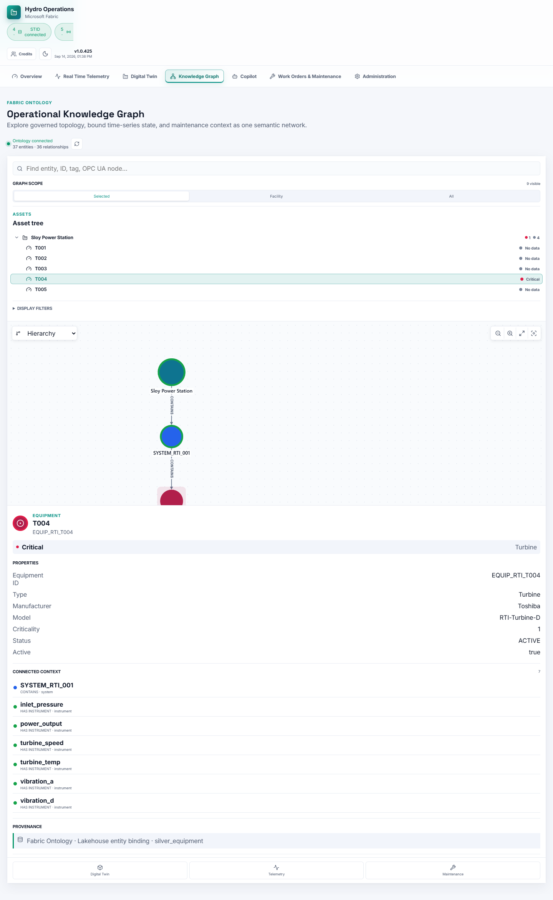
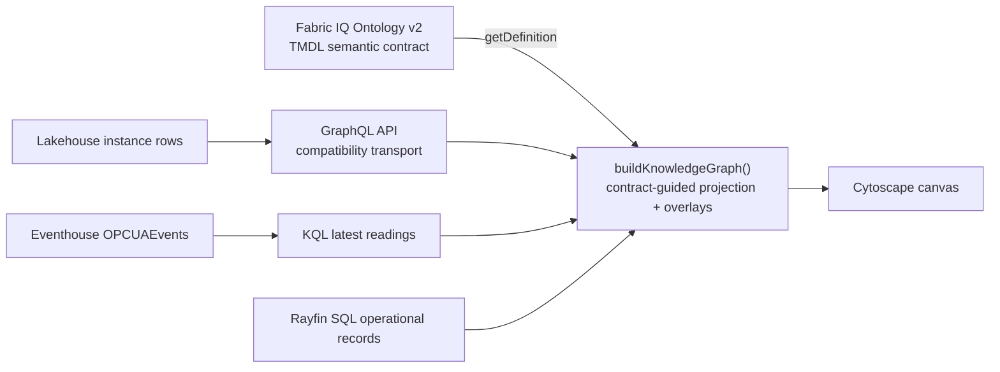
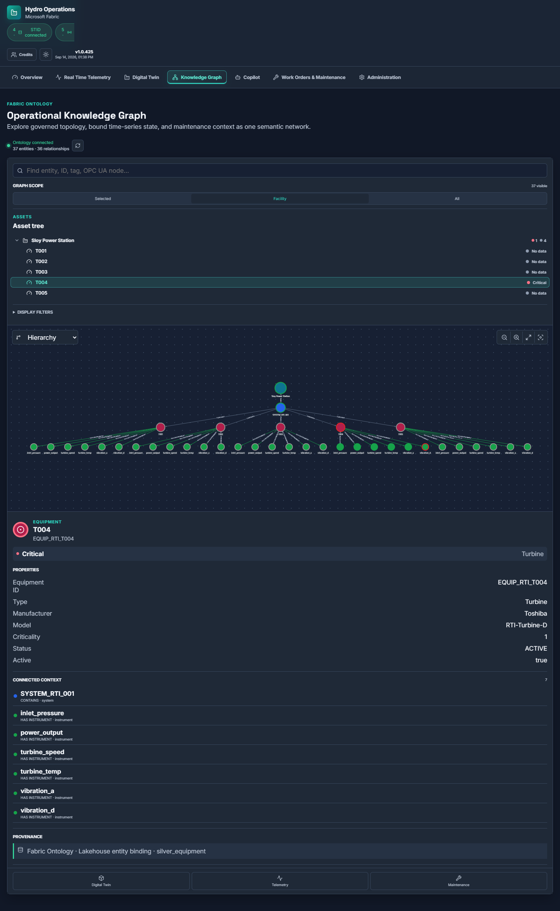

# Hydro Operations Knowledge Graph

## Purpose

The Knowledge Graph turns asset topology, live telemetry, and maintenance records into one
navigable operational context. It is designed for an operator who starts with a turbine or issue
and needs to move quickly between the affected facility, system, equipment, instruments, current
readings, inspections, notifications, work orders, and 3D model.

The graph is not a replacement for the Fabric IQ Ontology, Real-Time Dashboard, or SQL system of
record. It is an application view that composes those governed sources and preserves their
provenance.



> [!NOTE]
> Screenshots in this document use the repository's synthetic STID fixture and cached telemetry so
> they are deterministic and contain no customer data. A live session shows the same interface with
> values loaded from the configured Fabric workspace.

## Useful scenarios

| Scenario | How the graph helps |
| --- | --- |
| Alarm and anomaly triage | Start from a critical signal, identify its instrument and turbine, then open telemetry or maintenance without losing selection. |
| Maintenance planning | See open work, notifications, inspections, and available model context around one asset instead of reconciling identifiers across screens. |
| Root-cause exploration | Traverse the governed signal-to-instrument-to-equipment-to-system-to-facility path and compare sibling context. |
| Shift handover | Share a compact facility or selected-asset context with health and provenance visible in one view. |
| Data-quality investigation | Distinguish critical operating state from uncertain quality, stale readings, and missing data. |
| Engineering impact analysis | Inspect which operational records and signals are connected before changing an asset, system, or instrumentation model. |
| AI grounding and audit | Use the same stable IDs and semantic relationships that ground the Fabric Data Agent, while retaining the source of each visual node and edge. |

## What exists in Fabric

The authoritative semantic asset is built before the app runs:

1. `RTI_004_build_ontology_mapping_rti_structured` creates five Fabric IQ Ontology v2 entity types,
   four relationship types, and time-series properties.
2. `RTI_005_entity_DataBinding_rti_structured` adds static Lakehouse data bindings and relationship
   contextualizations.
3. `RTI_006_TimeSeriesBinding_RTI_signal` binds Eventhouse `OPCUAEvents` observations to
   `signal_master`.
4. `RTI_009_build_data_agent` publishes only a verified v2 Ontology as a Data Agent source when
   product support and the configured policy permit it; blocked onboarding is reported explicitly.
5. `RTI_011_seed_sql_wire_graphql_agent` creates the app-facing GraphQL API and adds Rayfin SQL as
   another Data Agent source when an agent is available. SQL/GraphQL provisioning does not require
   a Data Agent.

The governed semantic path is:

```text
signal_master -> instruments -> equipment -> systems -> facilities
```

**This project requires Ontology v2.** Existing generation-1 items are rejected, not consumed through
a legacy parser or used as agent sources. Generation-2 graph materialization is optional, and the
project does not yet have a verified v2 GraphModel association contract. Native graph access is
therefore explicitly unavailable, even when a sole or similarly named Graph Model exists.
The application uses GraphQL instance rows with the live v2 semantic contract instead. It does not
claim that this compatibility projection is a native query of asserted or derived graph edges.

## Application implementation

The SPA uses the live Fabric IQ Ontology v2 definition for semantic metadata and Lakehouse GraphQL
for compatible instance data:


```mermaid
flowchart LR
   DEF["Fabric IQ Ontology v2\nTMDL semantic contract"]
   LH["Lakehouse instance rows"]
    EH["Eventhouse OPCUAEvents"]
    SQL["Rayfin SQL operational records"]
   GQL["GraphQL API\ncompatibility transport"]
    KQL["KQL latest readings"]
   BUILD["buildKnowledgeGraph()\ncontract-guided projection + overlays"]
    CY["Cytoscape canvas"]

   DEF -->|"getDefinition"| BUILD
   LH --> GQL --> BUILD
    EH --> KQL --> BUILD
    SQL --> BUILD
    BUILD --> CY
```

`queryOntologyContract()` requires generation 2 and reads TMDL entity/ontology-relationship parts.
Physical TOM relationships in `relationships.tmdl` are not semantic ontology edges.
`queryOntologyGraph()` reports the missing verified v2 graph association rather than guessing.
`buildKnowledgeGraph()` projects compatible Hydro rows using the semantic relationships and binding
keys in the contract. Unsupported joins must not be invented. Known Hydro entity classes receive
tailored labels and health behavior; arbitrary new instance sources require compatible data access.

For page-load performance, Cytoscape is route-lazy and
single-flight requests prevent duplicate calls. The page defaults to a selected-asset projection;
facility and all-graph views are opt-in. Cytoscape reconciles changed element data in place, so live
polls preserve the current viewport, selection, and dragged node positions instead of rebuilding
the graph. A layout is rerun only on initial load or when the operator selects a different layout.

Latest Eventhouse readings enrich the measurement point by `opcua_node_id`; this preserves telemetry
freshness independently of the Graph Model ingestion schedule. When one `signal_master` node has a
one-to-one `signals_from_instruments` binding, the UI combines it with that instrument into one
visual node and retains both entities in the inspector provenance. This removes duplicate labels
without changing the governed Graph Model. Unbound and non-one-to-one signals remain explicit nodes.
Rayfin SQL work orders, inspections, notifications, and 3D models are joined by `equipmentId`,
`instrumentId`, or `opcuaNodeId` as explicit external overlays. Existing GraphQL/STID reads remain a
compatibility path for other app pages and for graph fallback only when direct GQL is unavailable.

The application does not execute GraphModel queries without a verified v2 association.
REST `/v1` does not mean Ontology generation 1.
Cytoscape is only the renderer; it is not the semantic or instance source of truth.

## Freshness contract

The page refreshes ontology state on entry, while visible, and on focus/refresh. A failed definition
read invalidates cached semantic data rather than returning an old successful contract. No
30-second native-graph freshness guarantee is made while v2 graph association is unavailable.
Lakehouse GraphQL visibility depends on its source synchronization. Eventhouse values are queried
separately on a 30-second cycle so operational readings do not wait for graph materialization.

## Interaction model

The left asset tree and graph share the same selected facility and turbine state used by Overview,
Real-Time Telemetry, Digital Twin, and Maintenance.

| Scope | Visible context |
| --- | --- |
| Selected | The selected turbine, its instruments and operational records, parent system, and facility. This is the default and minimizes clutter. |
| Facility | All graph entities associated with the selected facility. |
| All | Every loaded entity and relationship. Use for discovery and model inspection. |

Search and display filters further restrict entities by text, class, and operational state. Selecting
an equipment or instrument node updates the shared application selection. The inspector exposes
properties, bound readings, connected context, provenance, and links to Digital Twin, Telemetry, and
Maintenance.



## Identity, joins, and provenance

| Source | Graph content | Stable join |
| --- | --- | --- |
| Ontology v2 TMDL + Lakehouse GraphQL | Contract-guided Hydro entities and supported semantic relationships | Entity keys and declared relationship binding columns |
| Fabric Eventhouse | Latest and historical telemetry enrichment | `opcua_node_id` |
| Rayfin SQL | Work orders, notifications, inspections, 3D models | `equipmentId`, `instrumentId`, `opcuaNodeId` |

Every node records source provenance. Cross-store referential integrity is conventional rather than
transactional: SQL cannot enforce a foreign key into Lakehouse or Eventhouse, so stable identifiers,
seed validation, and orphan checks are required.

## Health semantics

Operational health and entity type must use separate visual channels:

- red: active critical condition or `BAD` quality;
- amber: warning or `UNCERTAIN` quality;
- green: healthy and current;
- gray: no data, unavailable, or too stale to classify safely.

The current canvas uses entity-type fill colors and health rings. The intended refinement is for
health to be the dominant color while type is communicated by icon, label, shape, or a subtle badge.
Health should roll upward from signal to equipment, system, and facility using the worst active
descendant state. The inspector must explain why an entity is red, including the triggering signal
or operational record, source timestamp, quality, and provenance.

## Ontology-authoritative behavior

1. Discover the configured/versioned Ontology item, require generation 2, and read its live definition.
2. Parse entity types, properties, relationship types, bindings, and contextualizations into a
   versioned semantic contract.
3. Report native v2 graph unavailability until a verified association contract exists.
4. Project compatible Lakehouse rows using only supported declared semantic relationships.
5. Preserve semantic entity and relationship provenance on projected graph elements.
6. Attach Rayfin records as an explicit `hydro-operations` overlay with source and join provenance.
7. Label GraphQL/STID as a compatibility projection, never as native graph results.

This reuses the deployed v2 contract without silently substituting an unrelated graph or a v1 ontology.

## RDF and OWL export

Export should be generated from the Ontology contract plus resolved instances, never from canvas
position or transient filter state:

| Fabric concept | RDF/OWL representation |
| --- | --- |
| Entity type | `owl:Class` |
| Relationship type | `owl:ObjectProperty` |
| Scalar property | `owl:DatatypeProperty` |
| Entity instance | RDF resource with a stable IRI |
| Source/binding lineage | Named graph and PROV-O assertions |
| Sensor observation | SOSA/SSN observation where interoperability is required |

Use a stable namespace based on environment, Ontology, entity type, and entity ID. Keep Rayfin
operational extensions in a separate namespace. Turtle is the preferred review format; JSON-LD is
the preferred web interchange format. OWL export describes the schema, while RDF instance export
describes current entities, relationships, and optional observation snapshots.

## Validation

1. Verify a v1 item is rejected. For a v2 ontology, verify the TMDL contract and compatible entity
   paths, explicit native-graph unavailability, and that no unrelated Graph Model is selected.
2. Verify every edge references two existing nodes and every operational overlay record exposes its
   source join key.
3. Compare representative relationship paths with the `ontology_relationship_audit` output from
   RTI_004/005.
4. Select a turbine in Overview and verify Knowledge Graph restores it; select another turbine in
   the graph tree and verify all other operational tabs follow it.
5. Confirm Selected, Facility, and All scopes, search, type filters, and health filters work in light
   and dark themes at desktop and mobile widths.
6. Verify a `BAD` reading is critical, `UNCERTAIN` is warning, missing telemetry is no-data, and the
   inspector shows the evidence.
7. Run `npm run test:knowledge-graph`, `npm run typecheck`, `npm run lint`, and `npm run build`.

## Key implementation files

- [`HydroOperationsApp/src/services/fabric.ts`](../HydroOperationsApp/src/services/fabric.ts):
   v2 ontology discovery, GraphQL, KQL, Fabric jobs, and source-verified Data Agent access.
- [`HydroOperationsApp/src/services/ontologyGraph.ts`](../HydroOperationsApp/src/services/ontologyGraph.ts):
   graph response types/decoding utilities; not proof of an available v2 native-query path.
- [`HydroOperationsApp/src/services/rayfin.ts`](../HydroOperationsApp/src/services/rayfin.ts):
  operational SQL access.
- [`HydroOperationsApp/src/ui-shared/knowledgeGraphModel.ts`](../HydroOperationsApp/src/ui-shared/knowledgeGraphModel.ts):
  current application-side graph construction and provenance.
- [`HydroOperationsApp/src/ui-shared/pages/KnowledgeGraphPage.tsx`](../HydroOperationsApp/src/ui-shared/pages/KnowledgeGraphPage.tsx):
  scope, filters, shared selection, and inspector.
- [`HydroOperationsApp/src/ui-shared/components/knowledgeGraph/KnowledgeGraphCanvas.tsx`](../HydroOperationsApp/src/ui-shared/components/knowledgeGraph/KnowledgeGraphCanvas.tsx):
  Cytoscape rendering and layouts.
- [`Notebooks/RTI_004_build_ontology_mapping_rti_structured.Notebook/notebook-content.py`](../Notebooks/RTI_004_build_ontology_mapping_rti_structured.Notebook/notebook-content.py):
  authoritative entity and relationship definitions.
- [`Notebooks/RTI_005_entity_DataBinding_rti_structured.Notebook/notebook-content.py`](../Notebooks/RTI_005_entity_DataBinding_rti_structured.Notebook/notebook-content.py):
  static bindings and relationship contextualizations.
- [`Notebooks/RTI_006_TimeSeriesBinding_RTI_signal.Notebook/notebook-content.py`](../Notebooks/RTI_006_TimeSeriesBinding_RTI_signal.Notebook/notebook-content.py):
  Eventhouse time-series binding.
