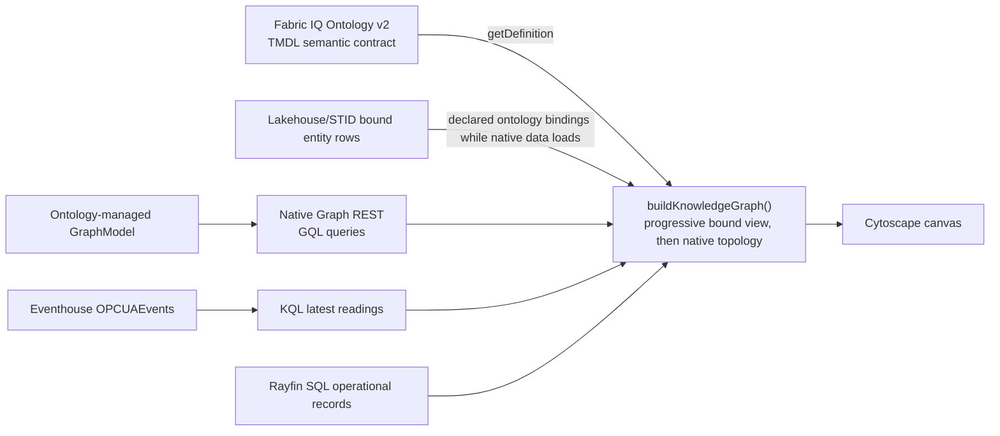

# Hydro Operations Knowledge Graph

## Purpose

The Knowledge Graph turns asset topology, live telemetry, and maintenance records into one
navigable operational context. It is designed for an operator who starts with a turbine or issue
and needs to move quickly between the affected facility, system, equipment, instruments, current
readings, inspections, notifications, work orders, and 3D model.

The graph is not a replacement for the Fabric IQ Ontology, Real-Time Dashboard, or SQL system of
record. It is an application view that composes those governed sources and preserves their
provenance.


> [!NOTE]
> Screenshots are historical UI illustrations using a synthetic STID fixture and cached telemetry,
> not evidence of native graph queries. Live native-v2 evidence and the remaining platform
> limitations are recorded below; these screenshots alone are not validation.

## Useful scenarios

| Scenario | How the graph helps |
| --- | --- |
| Alarm and anomaly triage | Start from a critical signal, identify its instrument and turbine, then open telemetry or maintenance without losing selection. |
| Maintenance planning | See open work, notifications, inspections, and available model context around one asset instead of reconciling identifiers across screens. |
| Root-cause exploration | Traverse the governed signal-to-instrument-to-equipment-to-system-to-facility path and compare sibling context. |
| Shift handover | Share a compact facility or selected-asset context with health and provenance visible in one view. |
| Data-quality investigation | Distinguish critical operating state from uncertain quality, stale readings, and missing data. |
| Engineering impact analysis | Inspect which operational records and signals are connected before changing an asset, system, or instrumentation model. |
| AI grounding and audit | Preserve stable IDs and semantic provenance for the default-enabled v2 Data Agent; provisioning and runtime support require separate verification. |

## What exists in Fabric

The authoritative semantic asset is built before the app runs:

1. `RTI_004_build_ontology_mapping_rti_structured` creates five Fabric IQ Ontology v2 entity types,
   four relationship types, and time-series properties.
2. `RTI_005_entity_DataBinding_rti_structured` adds static Lakehouse data bindings and relationship
   contextualizations.
3. `RTI_006_TimeSeriesBinding_RTI_signal` binds Eventhouse `OPCUAEvents` observations to
   `signal_master`.
4. `RTI_009_build_data_agent` attempts to publish the verified v2 Ontology as a Data Agent source
   by default. `auto` also attempts provisioning; only `disabled` opts out. Required failures propagate.
5. `RTI_011_seed_sql_wire_graphql_agent` creates the app-facing GraphQL API and adds Rayfin SQL as
   another Data Agent source unless explicitly disabled. Missing/ineligible required agents and
   source-extension failures fail the job even if SQL/GraphQL writes already succeeded.

The governed semantic path is:

```text
signal_master -> instruments -> equipment -> systems -> facilities
```

**This project requires Ontology v2.** Existing generation-1 items are rejected, not consumed through
a legacy parser or used as agent sources. Graph materialization is required for native GQL reads,
but does not block the existing progressive view of Ontology-bound STID entities. Open the selected ontology,
choose **Manage graph → select eligible entities and relationships → Continue → Materialize**.
Use the resulting ontology-managed GraphModel, not an independently created look-alike graph.

Eligible graph sources require an entity key and a Delta or mirrored backing-table binding.
The multi-backing-table `signal_master` entity may be ineligible; select only eligible types.
Native instrument nodes can still receive KQL telemetry without materializing `signal_master`.
No published ontology-owned projection/materialization REST endpoint is established here: the
portal operation is a manual prerequisite, not an unattended deployment promise.

### Explicit graph binding

Configure `RAYFIN_PUBLIC_ONTOLOGY_GRAPH_BINDING` with the exact selected identities. In `.env`,
wrap the complete JSON value in **single quotes**:

```dotenv
RAYFIN_PUBLIC_ONTOLOGY_GRAPH_BINDING='{"workspaceId":"<workspace-guid>","ontologyId":"<ontology-guid>","graphModelId":"<managed-graph-guid>"}'
```

Optional `nodeTypes` and `edgeTypes` objects map aliases returned by `getQueryableGraphType` to
exact ontology type names or IDs when projected labels differ:

```dotenv
RAYFIN_PUBLIC_ONTOLOGY_GRAPH_BINDING='{"workspaceId":"<workspace-guid>","ontologyId":"<ontology-guid>","graphModelId":"<managed-graph-guid>","nodeTypes":{"<queryable-node-alias>":"<exact-ontology-entity-type-name-or-ID>"},"edgeTypes":{"<queryable-edge-alias>":"<exact-ontology-relationship-type-name-or-ID>"}}'
```

The single quotes are dotenv syntax, not part of the parsed JSON. They are essential when an exact
ontology name contains `#`: dotenv treats an unquoted `#` as the start of a comment, even inside
JSON double quotes, and would truncate the binding. Copy exact names/IDs from the contract and
aliases from live metadata; the placeholders above do not specify a naming convention.
Do not guess a namespace-label
delimiter: it is undocumented. Published REST metadata does not expose the ontology-to-graph
association, so this binding is an operator assertion established through the selected ontology's
Manage graph flow. Neither a matching name, a sole workspace graph, nor structural similarity
proves ownership. Live contract/type validation checks consistency, not ownership.

## Application implementation

The SPA uses the live Fabric IQ Ontology v2 definition for semantic metadata and its explicitly
bound native GraphModel for topology:


```mermaid
flowchart LR
   DEF["Fabric IQ Ontology v2\nTMDL semantic contract"]
   STID["Lakehouse/STID bound entity rows"]
   GM["Ontology-managed GraphModel"]
    EH["Eventhouse OPCUAEvents"]
    SQL["Rayfin SQL operational records"]
   GQL["Native Graph REST\nGQL queries"]
    KQL["KQL latest readings"]
   BUILD["buildKnowledgeGraph()\nprogressive bound view, then native topology"]
    CY["Cytoscape canvas"]

   DEF -->|"getDefinition"| BUILD
   STID -->|"declared ontology bindings while native data loads"| BUILD
   GM --> GQL --> BUILD
    EH --> KQL --> BUILD
    SQL --> BUILD
    BUILD --> CY
```

`queryOntologyContract()` requires generation 2 and reads TMDL entity/ontology-relationship parts.
Physical TOM relationships in `relationships.tmdl` are not semantic ontology edges.
`queryOntologyGraph()` verifies live numeric generation `2`, the live TMDL contract, configured
GraphModel metadata, queryable aliases, node/edge types, and relationship endpoints before accepting
native GQL results. `buildKnowledgeGraph()` preserves native topology when it is available.
While native reads are pending or unavailable, it retains the original progressive loading path:
existing STID entities are mapped through the verified v2 contract's entity bindings and declared
semantic relationship keys, then enriched with KQL/SQL. Arbitrary physical relationships and
unsupported junction joins do not become semantic edges. Bound rows have compatibility provenance,
not native OIDs or a claim of successful GQL execution.

Relative to `/v1/workspaces/{workspaceId}/`, native reads use
`GET graphModels/{id}/getQueryableGraphType?beta=true` and
`POST graphModels/{id}/executeQuery?beta=true` with a `query` body. Query pagination follows opaque
string `result.nextPage` continuations without interpreting or reconstructing them. Query errors,
warnings, truncation, malformed responses, dangling edges, or limits exceeding **2,000 nodes /
4,000 edges** fail closed; a partial result is never presented as a complete graph.

For page-load performance, Cytoscape is route-lazy and
single-flight requests prevent duplicate calls. Discovery's parsed ontology contract is reused,
avoiding a second definition download on first graph load. Contract and graph caches retain the
original 15-minute lifetime; the 30-second native poll explicitly refreshes graph instances only.
Workspace discovery changes restart obsolete reads instead of displaying a cache-revision error.
The page does not hide available bound entities behind the native-query loading screen.
The page defaults to a selected-asset projection;
facility and all-graph views are opt-in. Cytoscape reconciles changed element data in place, so live
polls preserve the current viewport, selection, and dragged node positions instead of rebuilding
the graph. A layout is rerun only on initial load or when the operator selects a different layout.

Latest Eventhouse readings enrich the measurement point by `opcua_node_id`; this preserves telemetry
freshness independently of graph materialization. When one native `signal_master` node has a
one-to-one native `signals_from_instruments` relationship, the UI combines it with that instrument into one
visual node and retains both entities in the inspector provenance. This removes duplicate labels
without changing the governed v2 semantic contract. Unbound and non-one-to-one signals remain explicit nodes.
The v2 adaptation retains the existing page layout, controls, friendly inspector labels, and
one-to-one signal presentation. Native identity validation and errors do not introduce new panels.
Rayfin SQL work orders, inspections, notifications, and 3D models are joined by `equipmentId`,
`instrumentId`, or `opcuaNodeId` as explicit external overlays attached to the corresponding
native or Ontology-bound equipment. Existing GraphQL/STID reads support the progressive view,
as on main. Native graph results replace that instance view once loaded; missing native edges
are never filled in from foreign keys.

The application does not execute GraphModel queries without an explicit, validated v2 graph binding.
REST `/v1` does not mean Ontology generation 1.
Cytoscape is only the renderer; it is not the semantic or instance source of truth.

## Freshness contract

The page refreshes ontology state on entry, while visible, and on focus/refresh. A failed definition
read invalidates cached semantic data rather than returning an old successful contract. Native graph
visibility depends on successful materialization and subsequent source synchronization; request
refresh is not a guarantee of newly materialized source data. Eventhouse values are queried
separately on a 30-second cycle so operational readings do not wait for graph materialization.

## Interaction model

The left asset tree and graph share the same selected facility and turbine state used by Overview,
Real-Time Telemetry, Digital Twin, and Maintenance.

| Scope | Visible context |
| --- | --- |
| Selected | The selected turbine, its instruments and operational records, parent system, and facility. This is the default and minimizes clutter. |
| Facility | All graph entities associated with the selected facility. |
| All | Every loaded entity and relationship. Use for discovery and model inspection. |

Search and display filters further restrict entities by text, class, and operational state. Selecting
an equipment or instrument node updates the shared application selection. The inspector exposes
properties, bound readings, connected context, provenance, and links to Digital Twin, Telemetry, and
Maintenance.


## Identity, joins, and provenance

| Source | Graph content | Stable join |
| --- | --- | --- |
| Ontology-managed native GraphModel + live v2 TMDL | Native entities and governed relationships, validated against the contract | Native identities and resolved ontology type aliases |
| Fabric Eventhouse | Latest and historical telemetry enrichment | `opcua_node_id` |
| Rayfin SQL | Work orders, notifications, inspections, 3D models | `equipmentId`, `instrumentId`, `opcuaNodeId` |

Every node records source provenance. Cross-store referential integrity is conventional rather than
transactional: SQL cannot enforce a foreign key into Lakehouse or Eventhouse, so stable identifiers,
seed validation, and orphan checks are required.

## Health semantics

Operational health and entity type must use separate visual channels:

- red: active critical condition or `BAD` quality;
- amber: warning or `UNCERTAIN` quality;
- green: healthy and current;
- gray: no data, unavailable, or too stale to classify safely.

The current canvas uses entity-type fill colors and health rings. The intended refinement is for
health to be the dominant color while type is communicated by icon, label, shape, or a subtle badge.
Health should roll upward from signal to equipment, system, and facility using the worst active
descendant state. The inspector must explain why an entity is red, including the triggering signal
or operational record, source timestamp, quality, and provenance.

## Ontology-authoritative behavior

1. Discover the configured/versioned Ontology item, require generation 2, and read its live definition.
2. Parse entity types, properties, relationship types, bindings, and contextualizations into a
   versioned semantic contract.
3. Require the operator's explicit ontology-managed GraphModel binding; never infer ownership.
4. Validate live graph metadata, queryable types/endpoints, and complete native query responses.
5. Preserve native entity and relationship provenance, including exact ontology type mappings.
6. Enrich actual native entities with KQL and explicit `hydro-operations` SQL overlays.
7. Fail closed on missing prerequisites or invalid/incomplete native results; never substitute STID.

This reuses the deployed v2 contract without silently substituting an unrelated graph or a v1 ontology.

## RDF and OWL export (design guidance)

This is an interoperability design direction, not an implemented export feature or a promise that
all advanced v2 constructs are evaluated. An exporter should use the v2 TMDL contract plus resolved
instances, never canvas
position or transient filter state:

| Fabric concept | RDF/OWL representation |
| --- | --- |
| Entity type | `owl:Class` |
| Relationship type | `owl:ObjectProperty` |
| Scalar property | `owl:DatatypeProperty` |
| Entity instance | RDF resource with a stable IRI |
| Source/binding lineage | Named graph and PROV-O assertions |
| Sensor observation | SOSA/SSN observation where interoperability is required |

Use a stable namespace based on environment, Ontology, entity type, and entity ID. Keep Rayfin
operational extensions in a separate namespace. Turtle is the preferred review format; JSON-LD is
the preferred web interchange format. OWL export describes the schema, while RDF instance export
describes current entities, relationships, and optional observation snapshots.

## Validation

1. Verify a v1 item is rejected. For a v2 ontology, verify the live TMDL contract, explicit managed
   graph binding, queryable type mappings, and native result paths; reject unrelated graphs.
2. Verify every edge references two existing nodes and every operational overlay record exposes its
   source join key.
3. Compare representative relationship paths with the `ontology_relationship_audit` output from
   RTI_004/005.
4. Select a turbine in Overview and verify Knowledge Graph restores it; select another turbine in
   the graph tree and verify all other operational tabs follow it.
5. Confirm Selected, Facility, and All scopes, search, type filters, and health filters work in light
   and dark themes at desktop and mobile widths.
6. Verify a `BAD` reading is critical, `UNCERTAIN` is warning, missing telemetry is no-data, and the
   inspector shows the evidence.
7. Run `npm run test:knowledge-graph`, `node --import tsx --test scripts/artifact-discovery.test.mjs`,
   `npm run typecheck`, `npm run lint`, `npm run validate-env`, and `npm run build`.
8. Test opaque continuation strings, query warnings/errors, malformed/dangling results, and the
   2,000-node/4,000-edge boundaries. Verify native canvas/tree/scopes work with GraphQL unavailable.

Current live acceptance is restricted to **ws-vteam-demoV3** in tenant
`ad340c84-1886-4202-a483-2da2cb9168eb`, workspace `9c73201e-b2e5-48eb-81b9-3526d320faca`.
At the September 30, 2026 checkpoint **before the capability-parity restoration**, **74 Python
ontology tests, 65 app graph tests, and 75 deployment-orchestrator tests passed**. These are historical
results, not validation of the restored agent/alert flow. The four environment-export tests exercised
12 real Rayfin SDK rewrite cycles, Vite loading, and the application's strict graph-binding parser.
App typecheck, lint, environment validation, and the
production build also passed; the existing bundle-size warning remained. That checkpoint was
published to `feat/dibakar`, not `main`. The later bounded live attempts are recorded under
**Latest V3 acceptance** below; neither the historical tests nor the new results certify full
end-to-end operation.

### Earlier live execution (before the requested clean rebuild)

The user subsequently requested a from-scratch rebuild of this same workspace. The IDs and
row counts in this earlier acceptance record are historical, not the identities of the rebuilt
resources. **Fresh rebuild acceptance** is a second historical record; see **Latest V3 acceptance**
for the current item identities.

| Execution | Completed run ID | Verified result |
| --- | --- | --- |
| Setup pipeline | `5d8605e7-e149-4820-a0d2-696daca81993` | Complete notebook DAG and finalization; v2 authoring, static/time-series bindings, capability gates, and Weather schedule activation |
| Weather pipeline | `d97896cb-aa76-438e-a6ea-c11ea9f61bab` | Published Environment and populated Weather serving tables |
| Stream pipeline | `fa60a22b-7b44-4c92-b347-c98878077cfc` | Completed; live KQL readings cover all 90 instruments |
| RTI011 | `59604761-8263-414a-b965-cc21e1dc8cdd` | Executed after streaming; operational SQL seed and STID/Weather GraphQL succeeded |
| Native graph refresh | `8713d187-2d49-4804-a62f-8946e869c3c1` | Supported four-entity/three-relationship projection materialized and became queryable |

The earlier concurrent Delta status writes were fixed by serializing **NB06 → NB09 → NB10**.
The missing Weather bootstrap was restored through the existing helpers. After the previous
Environment publication failed, supported republishing succeeded; exactly one six-hour schedule
is now enabled. Those earlier failures are resolved, not current acceptance blockers.
The scheduled capacity pause was also observed and the same capacity resumed without resizing.

Operational SQL contains **12 WorkOrders, 30 Inspections, 6 Notifications, 12 SpareParts, and
15 Asset3DModels**. The live STID GraphQL endpoint returned HTTP 200 without GraphQL errors:
**3 facilities, 3 systems, 15 equipment, 90 instruments, 120 Weather forecasts, and 72 observations**.
That historical run used capability gates that allowed core provisioning despite reported agent
blockers. It is **core-only evidence**, not current full-capability certification. The restored
default-enabled policy now attempts both agents (also for `auto`) and propagates required failures.
At that checkpoint, live agent/playbook/action/Teams/email acceptance was still pending. The later
attempts below establish source/configuration evidence, not successful semantic runtime or delivery.

### Earlier native graph and enrichment evidence

Ownership was established through the selected ontology's actual **Manage graph** workflow:
ontology `d0d041aa-13ea-4277-aa6e-1d3ab565a2d4` owns the verified projection
`87bb9ac2-4599-44b9-8014-b45c696332bd`. Its queryable schema returns HTTP 200.
The application's actual TypeScript contract parser and native GQL query client successfully read
**111 native nodes and 108 native edges**, validating every entity/relationship type against the
live v2 ontology.

The actual application graph model was then executed with those native results, live KQL readings,
and real SQL rows. It produced **174 nodes and 171 edges**, including:

- 90 telemetry-enriched native instruments.
- All 12 work orders, 30 inspections, 6 notifications, and 15 models joined to native equipment.
- Three facility scopes of 58 nodes each and 15 verified asset scopes.

STID topology input arrays were deliberately empty for this check: native identities and
relationships, not GraphQL/FK reconstruction, supplied the topology. These are API/model-level
acceptance results, not a claim that browser rendering and every UI interaction were tested.

### Product limitation: full TimeSeries projection

Materializing the entire five-entity ontology currently fails in this tenant with HTTP 400
`ModelValidationError`: `event_time`, `value`, and `quality` project as property type `INVALID`.
Diagnostic RootActivityId: `1049cf71-1c78-4391-b8c1-b1a4bc31d644`.
The [documented native graph workflow](https://learn.microsoft.com/en-us/fabric/iq/ontology/how-to-use-ontology-graph)
supports selecting a subgraph; its documented TimeSeries-to-base-type behavior did not work for
this full projection.

The verified supported workaround is to turn off **Use the entire Ontology** and explicitly select
`facilities`, `systems`, `equipment`, `instruments`, and their three hierarchy relationships:
`systems_in_facilities`, `equipment_in_systems`, and `instruments_on_equipment`.
Only the projection excludes `signal_master` and its relationship. The original ontology still
has **five entities, four relationships, and its valid TimeSeries declarations/bindings intact**.
KQL enriches native instruments through `opcua_node_id`. No ontology content was deleted and no
substitute graph was created. Full five-entity graph projection remains a product limitation.

### Earlier hosted application acceptance

The canonical deployment orchestrator completed with `SUCCESS` and `DEPLOYED_APP_URL` at
`https://maple-edge-ce46abd902-swedencentral.webapp.fabricapps.net`.
Backend, GraphQL/CORS, delegated permissions, consent, and protected-hosting identity checks passed;
all 31 existing Entra SPA redirects were preserved. Normal protected sign-in loaded the actual
Hydro Operations application, and an authenticated application-backend WorkOrder read returned
HTTP 200, 12 rows, and no GraphQL errors.

The canonical configuration producer now resolves public artifact metadata against the deployment
target, rather than carrying old V6 Eventhouse/KQL/GraphQL values into V3. An explicit, verified
native graph binding is required; discovery does not infer ownership from a GraphModel name.
The repository's environment exporter also preserves that JSON through Rayfin rewrites and Vite
loading, including `#` in alias maps. The browser parser remains strict; an escaped dotenv value
is not accepted as a substitute for valid binding JSON.

The earlier build **1.0.614 / `05ead69`** failed the actual Vite-load/strict-parser binding check.
Producer repair `ba82f68` subsequently passed real deployment acceptance during the clean rebuild
below. Fresh administrator sign-in resolved the intervening Azure Continuous Access Evaluation
challenge (`InteractionRequired`, `TokenCreatedWithOutdatedPolicies`); no authentication policy
was bypassed.

### Fresh rebuild acceptance (historical core-only evidence)

On September 30 the existing reset workflow removed the inspected demo resources from
`ws-vteam-demoV3` and verified the workspace empty. Git import from `feat/dibakar` succeeded,
the fresh Weather Environment published, and the new setup pipeline
`009eb90e-c5ee-4488-a272-0b46644d517f` completed. The workspace, capacity, Key Vault, tenant SPA,
local repository, and existing Entra redirects were preserved. Only the permitted local Rayfin
state files were moved to unique backups.

The new native projection was configured through the newly created ontology's Manage graph UI:

- Ontology: `b95ea082-8a58-405c-a924-89a3e661f697`, verified generation **2**.
- Managed graph: `ea642a1e-db47-4b28-8a8e-c101a08acb0d`.
- Native refresh: `2d113fdd-2c10-418f-b849-51b49b8fd27b`, **Completed** at `04:51:42Z`.
- Actual application contract/parser/GQL client: **111 nodes and 108 edges**, using the supported
  four-entity/three-relationship projection without removing the ontology's TimeSeries declarations.

The canonical deployment and subsequent binding redeployment both completed with `SUCCESS`:
**https://icy-twist-acc301b27a-swedencentral.webapp.fabricapps.net**.
The new AppBackend is `3860fb61-bd8b-40da-94b2-d651f1c0a1d4`. Protected hosting, backend browser
paths, delegated permissions, and redirect-preservation checks passed. Normal protected sign-in
loaded hosted build **1.0.617 / `d5240a8`**. Generated-origin commit `71f9ad2` was pushed to the
feature branch; `main` was not changed.

After all deployment commands, the **actual generated Vite configuration** passed the application's
strict `parseGraphBinding` check with the new expected workspace/ontology/graph IDs. Eventhouse
and KQL database names resolve to V3. This verifies the JSON-escaping repair in the real deployment,
not only a fixture.

Fresh data acceptance subsequently completed:

| Execution | New completed run | Evidence |
| --- | --- | --- |
| Weather | `ae823116-1c7e-4f8f-8958-63738a7666a2` | 516 forecasts, 391 observations, 516 area metrics; 120 forecast / 69 observation serving rows |
| Stream | `fd35d0fa-ec35-4f81-a68a-6ccb3f8858c1` | 9,003 current-run rows across 90 signals; event timestamps `04:48:35Z` through `05:12:49Z` |
| RTI011, executed once after streaming | `61e718b5-ef39-46a2-b363-83a5b70ac4ba` | Completed `05:19:03Z`; operational seed and GraphQL provisioning succeeded |

The rebuilt SQL database `9cf6db24-754d-4ee9-ac3b-1a451699a677` contains **12 WorkOrders,
30 Inspections, 6 Notifications, 12 SpareParts, and 15 Asset3DModels**. New STID GraphQL API
`03e84dfd-7cd1-4566-9f8b-9106ab59fcec` returned **3 facilities, 3 systems, 15 equipment, and
90 instruments**. The new hosted application's authenticated backend WorkOrder request returned
**HTTP 200, 12 rows, and no GraphQL errors**.

Finally, the actual application model was rerun using the postdeployment Vite binding, the fresh
native graph, current KQL readings, and real rows exported from the rebuilt SQL database.
It passed with **174 combined nodes / 171 edges**, **90 telemetry-enriched native instruments**,
all **three facility scopes** (58 nodes each), and all **15 asset scopes**.
STID topology inputs were empty throughout that check; topology remains native-ontology-owned.
This is fresh API/model acceptance, not reused evidence from the deleted resources.

**Remaining interactive acceptance:** the separate Fabric/MSAL popup is outside the integrated
browser automation's accessible pages. Hosted Fabric Connect, graph canvas/tree/filter interactions,
and operational create/update/delete have not yet been certified. The browser's authenticated
request-context replay is also unsupported by this host (`Storage.getCookies` unavailable).
These limitations were not bypassed by weakening authentication, injecting credentials, or using
fake browser data. Complete the interactive checks above before describing the entire hosted UI
as end-to-end certified.

### Latest V3 acceptance (September 30, 2026)

This record supersedes the earlier item identities above, without replacing their historical
evidence. Corrective commit `8ac32e0` and the live-proven Operations Agent action-type correction
`70f99a4` were pushed to **`feat/dibakar` only**; `main` was not changed. Times below are the reported
run times; abbreviated run IDs are explicitly prefixes, not full identifiers.

| Current item | ID |
| --- | --- |
| Ontology v2 | `0e34df51-28bd-44db-93d0-71d90bcffbf8` |
| Ontology-managed graph | `1243b115-ca47-417a-8886-ccb7c2f16b68` |
| Data Agent | `2fa36931-2ddd-459b-9803-a45cb8cd13ae` |
| Operations Agent | `16024bc3-1c4f-4094-ab36-a2cfb0964987` |
| STID GraphQL | `33b7c87b-e707-439f-a197-e734d3045ba0` |

| Live check | Recorded run/time | Evidence and limit |
| --- | --- | --- |
| Entire five-entity projection | HTTP 400 | All three TimeSeries properties (`event_time`, `value`, `quality`) still project as `INVALID`; this product limitation is not resolved |
| Selected four-entity/three-relationship projection | Refresh prefix `ff0d8113`, Completed 15:58 | Native projection became queryable; the ontology itself still has all five entities and four relationships |
| Canonical app deployment | `SUCCESS`, 16:06 | Same `icy-twist` host, backend/SQL checks, and all 32 existing SPA redirects preserved; protected-hosting gate, not interactive application acceptance |
| Weather | Prefix `eed6c26b`, Completed 16:08 | 516 forecasts, 405 observations, 516 metrics; serving tables contain 120 forecasts / 69 observations |
| Stream | Prefix `fb83f3f5`, Completed 16:19 | 9,002 rows across 90 signals |
| RTI_011 | Prefix `190fbd8a`, Completed 16:26 | SQL and GraphQL succeeded; all five selected SQL tables verified in the published agent definition; not proof of ontology runtime |
| RTI_010 rerun | Prefix `018e1356`, Completed | Full Operations Agent configuration retained; agent configured and stopped |

After deployment, the **actual production application parsers and graph model** passed against the
new resources: five ontology entities/four relationships and all three time-series backings;
**111 native nodes / 108 edges**; actual KQL readings for **90 signals**; and a fresh SQL export.
The combined model produced **174 nodes / 171 edges** and **three facility scopes of 58 nodes each**.
STID topology input arrays were **empty**. This is new API/model-level evidence, not browser
canvas/tree/filter or operational CRUD acceptance.

**Data Agent: publication is not semantic runtime.** A real MCP ontology question failed inside
`analyze_ontology` with **API version not supported**, even though the MCP envelope contained
`isError: false`. That envelope flag cannot certify functional success. A separate SQL-only MCP
question correctly returned **12 work orders**. Neither SQL success nor matching published source
identity proves that the ontology question works. The fresh pre-update MCP probe returned HTTP 200
with the unsupported-API semantic error (RootActivityId `5082e3f9-6b1e-45a5-b675-acfe7d8660e2`).
That probe preceded the authorized revised-NB09 run documented below; it remains historical
publication/semantic-error evidence, not a verified smoke result.

The revised implementation requires a **bounded functional smoke test**, not full agent
certification or attested execution provenance:

- NB09 asks only for the selected ontology's first five facility IDs/names, without including
  expected values in the prompt. It compares exact returned records with independently read rows
  in the configured Lakehouse. Attached SQL sources are permitted and preserved; no cached proof
  is required for this new check.
- `data_agent_publication_status=published` records source publication independently. Successful
  comparison sets `data_agent_deployment_status=ready` and `data_agent_runtime_status=verified`,
  with evidence `verification=ontology_facilities_smoke_v1` and scope
  **"Source-specific functional smoke test; execution provenance is not attested."**
  These labels do not certify cryptographic provenance, SQL/combined-source answers, or the entire
  agent.
- Semantic errors (including nested JSON errors despite `isError: false`), wrong rows, and
  transport failures are `failed`. Nonparseable, count-only, or otherwise unverifiable answers are
  `inconclusive`. Both fail required modes; neither is a static v2 skip.
- NB11 configures its SQL source independently of NB09's ontology status or attachment.
  It preserves existing sources and custom content, verifies the submitted SQL source in draft
  and published readback, and writes only its own SQL-source status. It neither requires nor
  manufactures successful ontology-runtime evidence. Real SQL/GraphQL/source-publication errors
  still fail NB11. NB09's required ontology failure remains a separate setup limitation.

The reported **58 focused offline tests** and parent-run **102/102 full ontology regressions on
Python 3.12** passed. These test results do not establish healthy ontology runtime.

#### Authorized live NB09 failure-path validation

**Failure-path validation passed; the NB09 job correctly FAILED.** Only the NB09, NB11, and setup
orchestrator notebook definitions were updated. Exact definition readbacks preserved live metadata,
attachments, parameter/configure cells, and all other parts. Only NB09 was executed, once:

- Job `b1818634-f77e-4dec-ab55-982460ecb101`, September 30, 2026,
  **17:04:17.981Z–17:10:55.532Z**.
- Required-readiness failure: **"Data Agent published but ontology runtime failed: The request is
  invalid. This API version is not supported for the specified Ontology item."**
- RootActivityId `860accc8-feb7-4717-a44f-53fcf172b7c6`; MCP `tools/call` request
  `ef7abc1e-2b91-42ed-82d5-9ca002855319`. MCP initialize/list/call each returned HTTP 200, and
  the actual `isError: false` semantic error was correctly detected rather than treated as readiness.

Persisted settings were verified directly from active **Delta snapshot 23** through read-only
OneLake:

| Setting | Persisted result |
| --- | --- |
| Agent mode | `enabled` |
| `data_agent_deployment_status` | `failed` |
| `data_agent_publication_status` | `published` |
| `data_agent_runtime_status` | `failed` |
| `data_agent_sql_source_status` | `published` |

The complete **16,216-character runtime evidence** was valid JSON in Delta. The SQL endpoint read
used for inspection truncated that value at 8,000 characters, so it was not used to certify evidence
completeness.

Draft **and** published agent definitions retained ontology and SQL identities, all **five selected
SQL tables**, all **five ontology elements**, exact custom instructions/selections, and other
capability content. The full-part comparison found only `publish_info.description` changed from
NB11's publication note to NB09's publication note; `.platform` and every other part were equal.
After the failed NB09 run, a new SQL-only MCP question still returned exactly
`{"workOrderCount":12}`, with `isError: false` and no semantic error.

This proves truthful required failure plus multi-source/custom-content preservation. It does
**not** prove healthy ontology runtime or a successful smoke check. There was no retry, full setup
run, NB11 execution, Operations Agent activation, alert send, reset, or further source change in
this bounded validation.

**Operations Agent: full configuration accepted, execution untested.** The first live request
returned HTTP 400 for the action type `DataPipeline`. Changing **only** that enum to the original
`Pipeline` yielded HTTP 200 with the complete configuration retained; no playbook, action, Teams
setting, or email component was removed. `OperationsAgentV1` is the agent configuration format,
not Ontology v1. The actual Operations Agent UI showed instructions, the selected ontology source,
the connected email action, and the authored BAD/UNCERTAIN rules. The rerun remains
`configured`/stopped: activation, monitoring, action execution, and Teams/email sends were **not**
verified. No product-wide playbook-runtime fix is claimed.

The deployment URL remains
**https://icy-twist-acc301b27a-swedencentral.webapp.fabricapps.net**. Protected hosting succeeded,
but the separate authentication popup prevented interactive application acceptance; do not carry
forward earlier browser evidence as certification of this deployment.

**Update boundary:** an earlier full `PreferRemote` Git import removed generated resources, which
were restored through setup. Do not repeat a full Git import for these corrections. Subsequent
updates are bounded notebook-definition updates; the records above are not authorization for
another workspace reset or import.

## Key implementation files

- [`HydroOperationsApp/src/services/fabric.ts`](../HydroOperationsApp/src/services/fabric.ts):
   v2 ontology discovery, GraphQL, KQL, Fabric jobs, and source-verified Data Agent access.
- [`HydroOperationsApp/src/services/ontologyGraph.ts`](../HydroOperationsApp/src/services/ontologyGraph.ts):
   graph response types and native result decoding.
- [`HydroOperationsApp/src/services/ontologyGraphQuery.ts`](../HydroOperationsApp/src/services/ontologyGraphQuery.ts):
   explicit binding, queryable-type validation, native GQL requests, and bounded pagination.
- [`HydroOperationsApp/src/services/rayfin.ts`](../HydroOperationsApp/src/services/rayfin.ts):
  operational SQL access.
- [`HydroOperationsApp/src/ui-shared/knowledgeGraphModel.ts`](../HydroOperationsApp/src/ui-shared/knowledgeGraphModel.ts):
  current application-side graph construction and provenance.
- [`HydroOperationsApp/src/ui-shared/pages/KnowledgeGraphPage.tsx`](../HydroOperationsApp/src/ui-shared/pages/KnowledgeGraphPage.tsx):
  scope, filters, shared selection, and inspector.
- [`HydroOperationsApp/src/ui-shared/components/knowledgeGraph/KnowledgeGraphCanvas.tsx`](../HydroOperationsApp/src/ui-shared/components/knowledgeGraph/KnowledgeGraphCanvas.tsx):
  Cytoscape rendering and layouts.
- [`Notebooks/RTI_004_build_ontology_mapping_rti_structured.Notebook/notebook-content.py`](../Notebooks/RTI_004_build_ontology_mapping_rti_structured.Notebook/notebook-content.py):
  authoritative entity and relationship definitions.
- [`Notebooks/RTI_005_entity_DataBinding_rti_structured.Notebook/notebook-content.py`](../Notebooks/RTI_005_entity_DataBinding_rti_structured.Notebook/notebook-content.py):
  static bindings and relationship contextualizations.
- [`Notebooks/RTI_006_TimeSeriesBinding_RTI_signal.Notebook/notebook-content.py`](../Notebooks/RTI_006_TimeSeriesBinding_RTI_signal.Notebook/notebook-content.py):
  Eventhouse time-series binding.
